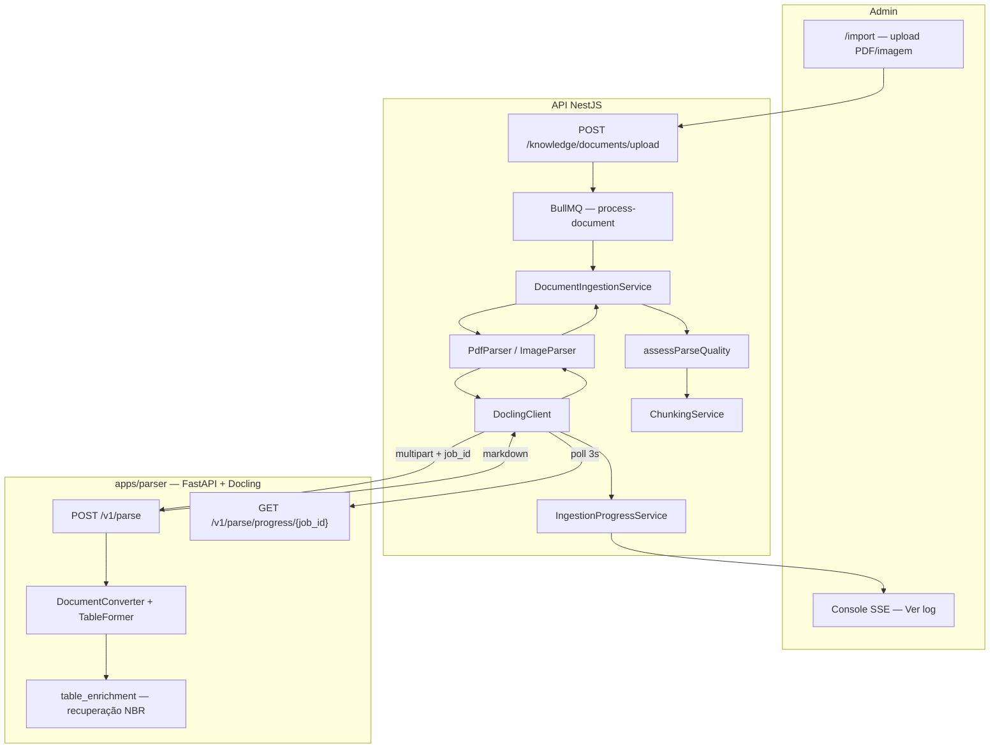
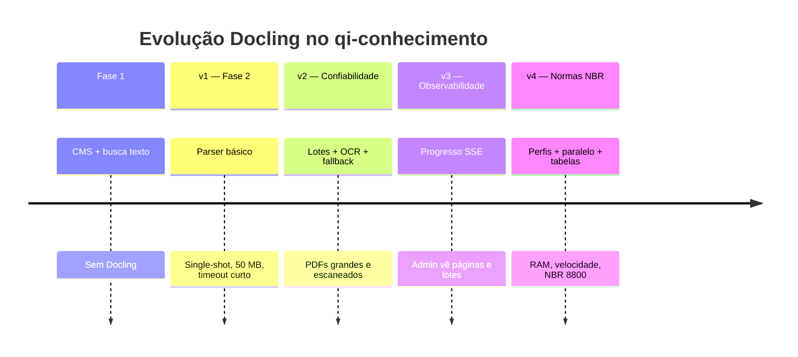

# Docling — evolução, arquitetura e próximos passos

Documento de referência sobre o uso do [Docling](https://github.com/docling-project/docling) no **qi-conhecimento**: por que adotamos, como evoluiu, o que funciona hoje e o que vem a seguir.

Documentação complementar:

- [parser-service.md](./parser-service.md) — contrato HTTP e variáveis do serviço
- [knowledge-rag.md](./knowledge-rag.md) — pipeline de ingestão completo
- [development/local-setup.md](../development/local-setup.md) — setup e troubleshooting
- [apps/parser/README.md](../../apps/parser/README.md) — README operacional do microserviço

---

## O que é Docling neste projeto

Docling é a **engine principal de conversão documento → Markdown** na esteira RAG. Roda como microserviço Python (`apps/parser`, FastAPI) e é acionado pela API NestJS quando `PARSER_SERVICE_URL` está definido no `.env`.

| Entrada | Saída | Uso |
| --- | --- | --- |
| PDF técnico (normas NBR, manuais) | Markdown com headings, tabelas e layout | Chunking + embeddings + busca |
| Imagem (foto de norma, captura de tela) | Markdown estruturado | Idem |

**Sem Docling**, a qualidade cai drasticamente:

| Tipo | Fallback | Limitação |
| --- | --- | --- |
| PDF | `pdf-parse` (JS) | Sem layout, sem OCR, tabelas viram texto plano |
| Imagem | OpenAI Vision | Exige `OPENAI_API_KEY`, custo por imagem |

Docling **não** processa links/HTML (`HtmlParser` + Cheerio) nem texto manual do CMS.

---

## Por que um serviço separado

1. **Isolamento de dependências** — Docling traz PyTorch e modelos ML (~1 GB na primeira subida, ~2–3 GB RAM por worker).
2. **Runtime Node leve** — a API NestJS permanece sem stack Python.
3. **Open source (MIT)** — roda 100% local, alinhado ao uso de Ollama para embeddings.
4. **Escala independente** — em produção, o parser pode ir para um serviço Render/Docker separado sem redeployar a API.

---

## Arquitetura da integração



### Camadas e arquivos

| Camada | Arquivo | Responsabilidade |
| --- | --- | --- |
| Cliente HTTP | `apps/api/src/modules/ingestion/services/docling.client.ts` | Health, POST multipart, poll de progresso, timeout dinâmico |
| Roteamento PDF | `apps/api/src/modules/ingestion/parsers/pdf.parser.ts` | Docling primeiro; fallback `pdf-parse` |
| Roteamento imagem | `apps/api/src/modules/ingestion/parsers/image.parser.ts` | Docling primeiro; fallback Vision |
| Orquestração | `apps/api/src/modules/ingestion/services/document-ingestion.service.ts` | Progresso SSE, OCR, qualidade |
| Qualidade | `apps/api/src/modules/ingestion/utils/parse-quality.util.ts` | Detecta extração suspeita → oferta OCR |
| Serviço Python | `apps/parser/app/main.py` | Rotas FastAPI |
| Pipeline | `apps/parser/app/parser.py` | Lotes, backends, TableFormer |
| Paralelismo | `apps/parser/app/parallel.py` | `ProcessPoolExecutor` para lotes |
| Tabelas NBR | `apps/parser/app/table_enrichment.py` | Recupera dados da camada de texto do PDF |
| Perfis RAM | `apps/parser/app/config.py` | Presets `default` / `low_memory` / `high_memory` |
| Progresso | `apps/parser/app/progress.py` | Estado in-memory por `job_id` |
| Launcher dev | `scripts/dev-parser.mjs` | Carrega `.env` da raiz e sobe uvicorn |

---

## Pipeline Docling (estado atual)

### 1. Subida e warm-up

Na primeira requisição (ou no lifespan do FastAPI), o serviço instancia um `DocumentConverter` e baixa modelos Docling (~1 GB). O log `Parser service pronto` indica que está aceitando requisições.

### 2. Backends de PDF

O parser escolhe o backend conforme configuração e presença de tabelas:

| Condição | Backend | Motivo |
| --- | --- | --- |
| `PARSER_LOW_MEMORY=true` e tabelas **desligadas** | **pypdfium2** | Menor uso de RAM |
| `PARSER_DO_TABLE_STRUCTURE=true` (padrão) | **Docling-Parse** | TableFormer reabre imagens de página; pypdfium2 descarrega cedo demais → erro `Page backend was unloaded` |

Com tabelas ativas, `PARSER_IMAGES_SCALE` fica em **1.0** por padrão (scale 2.0 ≈ 4× RAM em normas longas).

### 3. TableFormer e recuperação de tabelas

**TableFormer** (`PARSER_DO_TABLE_STRUCTURE=true`):

- Modo `accurate` (padrão) ou `fast` (`PARSER_TABLE_MODE`)
- `PARSER_TABLE_CELL_MATCHING` — casa células com texto nativo do PDF

**Table image recovery** (`PARSER_TABLE_IMAGE_RECOVERY=true`):

Normas como NBR 8800 exportam tabelas ilustradas como `<!-- image -->` no Markdown do Docling, embora os valores numéricos ainda existam na camada de texto do PDF. O módulo `table_enrichment.py`:

1. Localiza captions `Tabela X — …` seguidas de placeholder de imagem
2. Extrai texto da região correspondente via pypdfium2
3. Monta tabela Markdown (inclui parser especializado para **Tabela H.1 — Valores teóricos de K**)

### 4. OCR

| Modo | Quando |
| --- | --- |
| Global | `PARSER_DO_OCR=true` no ambiente |
| Por requisição | Campo `do_ocr=true` no POST (usado em **Reprocessar com OCR** no admin) |
| Desligado (padrão) | PDFs com texto nativo — OCR em CPU pode levar **30–60+ min** em dezenas de páginas |

Engine na resposta: `docling` vs `docling+ocr`.

### 5. Lotes de páginas

PDFs longos não passam pelo conversor inteiro de uma vez:

1. Contagem de páginas via pypdfium2
2. Tamanho do lote via `effective_page_batch_size()` — reduz automaticamente em PDFs >30, >60 e >150 páginas
3. Um `DocumentConverter` **reutilizado** entre lotes sequenciais (evita recarregar modelos)
4. `gc.collect()` entre lotes

### 6. Paralelismo (workers)

Com `PARSER_PARALLEL_WORKERS=2` (perfil `high_memory`) ou auto:

- `ProcessPoolExecutor` — cada worker mantém **sua própria** cópia do `DocumentConverter`
- Custo: ~2–3 GB RAM **por worker**
- Progresso reportado pelo processo pai conforme lotes terminam
- `PARSER_THREADS_PER_WORKER` limita threads torch por worker

Regra de segurança: PDFs acima de `parallel_page_limit` (30 no `default`, 400 no `high_memory`) forçam **1 worker**.

### 7. Progresso e console admin

1. API gera `job_id` (UUID) e envia no POST
2. `DoclingClient` faz poll a cada **3 s** em `/v1/parse/progress/{job_id}`
3. `IngestionProgressService` traduz para SSE: `Docling — X/Y página(s) · lote N/M`
4. Estado do job fica **em memória** no parser — perdido ao reiniciar o serviço

### 8. Fallbacks na API

Comportamento do `PdfParser`:

| Situação | Resultado |
| --- | --- |
| `PARSER_SERVICE_URL` vazio + usuário **não** marcou fallback | Erro `DoclingRequiredError` |
| `PARSER_SERVICE_URL` vazio + **Permitir fallback pdf-parse** | `pdf-parse` |
| Docling falha (não timeout) + sem fallback | Erro |
| Docling **timeout** | **Sempre** cai para `pdf-parse` (mesmo sem opt-in) |
| Docling falha + fallback marcado | `pdf-parse` |

> **Atenção:** timeout → `pdf-parse` evita perder a ingestão, mas em PDFs escaneados o texto extraído pode ser mínimo. O admin oferece **Reprocessar com OCR** quando `assessParseQuality` detecta extração suspeita.

Imagens: qualquer falha Docling → OpenAI Vision (silencioso), sem progresso nem OCR por requisição hoje.

---

## Evolução cronológica

### Fase 0 — Antes do Docling (Fase 1)

- CMS Markdown manual
- Busca só por `$text` MongoDB
- Sem ingestão de PDF

### v1 — Docling inicial (17/06/2026 — commit `8657e82`, Fase 2)

**Entrega:** microserviço `apps/parser` + integração mínima.

| Item | Estado |
| --- | --- |
| FastAPI + `DocumentConverter` single-shot | ✓ |
| Rotas `/health`, `/v1/parse` | ✓ |
| `DoclingClient` básico (fetch, timeout ~120 s) | ✓ |
| Limite upload 50 MB | ✓ |
| Lotes, progresso, OCR por request | ✗ |
| Fallback automático em timeout | ✗ |

PDFs pequenos funcionavam; normas longas estouravam timeout ou RAM.

### v2 — Confiabilidade (18/06/2026 — commit `0678f26`)

Foco: PDFs grandes e PDFs escaneados sem perder a ingestão.

| Item | Detalhe |
| --- | --- |
| **Lotes de páginas** | Conversor reutilizado entre lotes |
| **Timeout escalável** | Default 2 h; mínimo dinâmico ~8 min + 4 min/MB na API |
| **Fallback em timeout** | `pdf-parse` automático |
| **OCR por requisição** | Campo `do_ocr` + endpoint `reprocess-with-ocr` |
| **Qualidade de parse** | `parseQualityWarning` + oferta OCR no admin |
| **Upload 150 MB** | Alinhado API + parser |
| **Checkbox fallback** | Admin — "Permitir fallback pdf-parse" |

### v3 — Observabilidade (18/06/2026 — commit `430498a`)

| Item | Detalhe |
| --- | --- |
| **`GET /v1/parse/progress/{job_id}`** | Páginas, lote, mensagem |
| **Poll na API** | A cada 3 s durante parse de PDF |
| **Console SSE** | Barra de progresso Docling no admin |
| **Cancelamento** | Válido enquanto embeddings ainda rodam |
| **Docs troubleshooting** | OOM, timeout, parser offline |

### v4 — Performance e normas técnicas (em desenvolvimento — working tree)

Melhorias no código atual (ainda não commitadas em parte):

| Item | Arquivo | Detalhe |
| --- | --- | --- |
| **Perfis de RAM** | `config.py` | `default`, `low_memory`, `high_memory` |
| **Workers paralelos** | `parallel.py` | Até 2 workers no `high_memory` |
| **Backend inteligente** | `parser.py` | Docling-Parse quando TableFormer ativo |
| **Table image recovery** | `table_enrichment.py` | Tabelas NBR a partir da camada de texto |
| **Caps dinâmicos de lote** | `config.py` | Redução automática por nº de páginas |
| **`dev-parser.mjs`** | script | Carrega `.env` da raiz (`PARSER_PROFILE`, etc.) |



---

## Capacidades atuais (checklist)

| Capacidade | PDF | Imagem |
| --- | --- | --- |
| Markdown estruturado (headings) | ✓ | ✓ |
| TableFormer | ✓ | — |
| Table image recovery (NBR) | ✓ | — |
| OCR sob demanda | ✓ | — |
| Lotes de páginas | ✓ | — |
| Workers paralelos | ✓ (perfil) | — |
| Progresso tempo real (SSE) | ✓ | ✗ |
| Fallback fraco | `pdf-parse` | Vision API |
| Perfis RAM (`PARSER_PROFILE`) | ✓ | ✓ |
| Health check admin | ✓ (`GET /knowledge/parser/status`) | ✓ |

---

## Limitações conhecidas

### Técnicas

| Limitação | Impacto | Mitigação |
| --- | --- | --- |
| Python 3.14 não suportado | `pip install` falha | Usar 3.11 ou 3.12 (`pnpm parser:setup`) |
| ~1 GB modelos na 1ª subida | Demora minutos | Aguardar `Parser service pronto` |
| OCR em CPU muito lento | 30–60+ min em PDFs escaneados | Só quando necessário; `PARSER_DO_OCR=false` |
| RAM ~2–3 GB por worker | OOM (`std::bad_alloc`) em normas 100+ pág. | `low_memory`, lote 4, 1 worker |
| Progresso in-memory | Perdido ao reiniciar parser | Reimportar se parser cair mid-parse |
| Timeout → pdf-parse silencioso | Texto quase vazio em scans | Console oferece OCR; ver badge de qualidade |
| Table recovery heurístico | Nem toda tabela vira Markdown perfeito | Parser H.1 específico; demais genérico |
| 1 documento por vez na fila | `IngestionProcessor` concurrency=1 | Aceitável em dev; fila serializa uploads |
| Docker compose mínimo | Não repassa perfis do `.env` | Preferir `pnpm parser:dev` local |

### Produto / contrato

- Resposta de parse expõe só `{ markdown, title?, engine? }` — **sem** metadados de página ou bounding boxes
- Chunking ignora proveniência Docling (capítulo, nº da página, id da tabela)
- Imagens não recebem `job_id` nem `do_ocr` da API hoje

---

## Configuração

### Habilitar Docling

```env
PARSER_SERVICE_URL=http://localhost:8000
PARSER_SERVICE_TIMEOUT_MS=7200000
PARSER_MAX_UPLOAD_MB=150
PARSER_PROFILE=high_memory   # ou default / low_memory
```

```bash
pnpm parser:setup   # uma vez
pnpm parser:dev     # terminal separado
pnpm dev            # API + admin
```

Verificação: `curl http://localhost:8000/health` → `{"status":"ok","engine":"docling"}`

### Perfis (`PARSER_PROFILE`)

| Perfil | RAM típica | Workers | Lote base | PDF 279 pág. |
| --- | --- | --- | --- | --- |
| `default` | 8–16 GB | 1 (auto) | 8 → 4 | 1 worker, lote 4 |
| `low_memory` | ≤8 GB | 1 | 4 → 3 | 1 worker, lote 3 |
| `high_memory` | 16–32 GB | 2 | 12 → 8 | 2 workers, lote 8 |

`PARSER_PARALLEL_WORKERS` e `PARSER_PAGE_BATCH_SIZE` **sobrescrevem** o perfil.

Tabela completa de variáveis: [parser-service.md](./parser-service.md) e [local-setup.md](../development/local-setup.md).

---

## Próximos passos

Roadmap organizado por prioridade. Itens marcados com *(doc)* já constam em docs anteriores; os demais derivam de gaps código/produto.

### Curto prazo — contrato e observabilidade

| # | Item | Motivação | Onde implementar |
| --- | --- | --- | --- |
| 1 | **Expor metadados no contrato de parse** *(doc)* | Enriquecer chunks com página, seção e id de tabela | `apps/parser` response + `ChunkingService` |
| 2 | **Health check do parser no boot da API** *(doc)* | Log/aviso quando `PARSER_SERVICE_URL` definido mas serviço offline | `DoclingClient.checkHealth()` no `onModuleInit` |
| 3 | **Commitar e revisar v4** | `parallel.py`, `table_enrichment.py`, perfis — estabilizar antes de produção | `apps/parser` |
| 4 | **Sinalizar fallback pdf-parse no admin** | Usuário deve saber quando timeout trocou o engine | Badge no console + `engine` no documento |

### Médio prazo — qualidade RAG

| # | Item | Motivação |
| --- | --- | --- |
| 5 | **Proveniência no chunking** | Propagar `chapter`, `section`, `normItem`, `page` do Docling para `KnowledgeChunk` |
| 6 | **Progresso para imagens** | `job_id` + poll no `ImageParser` (parse de imagem também demora com OCR) |
| 7 | **OCR configurável para imagens** | Passar `do_ocr` da API para imagens escaneadas |
| 8 | **Melhorar table recovery** | Generalizar além de NBR H.1; validar com NBR 8160, 5410, 8800 |
| 9 | **Testes de regressão** | PDFs fixture (10, 60, 150, 279 págs.) com snapshot de Markdown/chunks |

### Médio prazo — operação

| # | Item | Motivação |
| --- | --- | --- |
| 10 | **Docker compose com perfis** | Repassar `PARSER_PROFILE` e vars de tabela no `docker-compose.dev.yml` |
| 11 | **Deploy parser em produção** | Serviço Render/Docker separado; hoje opcional (pdf-parse na API) |
| 12 | **Persistência de progresso** | Redis ou estado compartilhado — sobreviver restart do parser |
| 13 | **Fila no parser** | Evitar bloquear worker FastAPI em PDFs de 2 h; job assíncrono com webhook |

### Longo prazo — produto

| # | Item | Motivação |
| --- | --- | --- |
| 14 | **Chunking semântico** | Usar estrutura Docling (sections, tables) em vez de só split por `##` |
| 15 | **Multimodal RAG** | Figuras e tabelas como assets referenciáveis nas citações |
| 16 | **GPU / OCR acelerado** | Reduzir tempo de OCR em PDFs escaneados (Docling + CUDA ou serviço dedicado) |
| 17 | **Parser como plugin** | Suportar outros engines (MinerU, Unstructured) com interface comum |

### Fora do escopo Docling (Fase 3)

WhatsApp Cloud API, Whisper (áudio), Telegram e histórico de consultas no admin — ver [scope/product-vision.md](../scope/product-vision.md) e [messaging.md](./messaging.md). Não alteram o pipeline Docling diretamente.

---

## Métricas de sucesso (sugeridas)

Para validar evoluções futuras:

| Métrica | Meta orientativa |
| --- | --- |
| Tempo parse NBR 279 pág. (`high_memory`, CPU) | < 45 min sem OCR |
| Chunks com `normItem` preenchido após parse | > 80% em normas estruturadas |
| Tabelas recuperadas vs `<!-- image -->` | > 70% em NBR 8800 H.x |
| Ingestões que caem em pdf-parse por timeout | < 5% com parser saudável |
| Chunks com embedding após import | 100% (Ollama/OpenAI configurado) |

---

## Referências externas

- [Docling — GitHub](https://github.com/docling-project/docling)
- [Docling — documentação](https://docling-project.github.io/docling/)
- [IBM Docling announcement](https://www.ibm.com/new/announcements/donut-docling-open-source-document-understanding)
