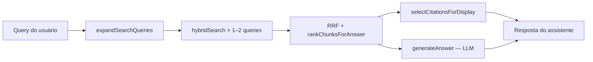

# Conhecimento e RAG

## Entidades

### KnowledgeDocument

Metadados da fonte ingerida:

| Campo | Descrição |
| --- | --- |
| `title` | Título do documento |
| `specialty` | Especialidade (`civil`, `hidraulica`, `eletrica`, `seguranca_trabalho`) |
| `sourceType` | `pdf`, `image`, `html`, `link`, `manual_text` |
| `sourceReference` | Caminho relativo em `STORAGE_PATH` ou URL |
| `normReference` | Ex.: `NBR 8160` |
| `ingestionStatus` | `pending` → `processing` → `completed` / `failed` / `cancelled` |
| `ingestionError` | Mensagem de erro ou motivo do cancelamento |
| `parseQualityWarning` | Aviso quando extração de texto é suspeitamente baixa |
| `offerOcrRetry` | Oferta de reprocessamento com OCR no admin |

### KnowledgeChunk

Pílula de conhecimento pós-chunking:

| Campo | Descrição |
| --- | --- |
| `content` | Texto plain (para busca `$text` e embeddings) |
| `markdownContent` | Conteúdo estruturado |
| `chapter`, `section`, `normItem` | Metadados de localização |
| `pageStart`, `pageEnd` | Página(s) no PDF de origem (Docling) |
| `contentType` | `paragraph` \| `table` \| `list` \| `mixed` |
| `headingPath` | Hierarquia de seções pai (ex.: `["H.1 Na flambagem por flexão"]`) |
| `tableCaption` | Caption da tabela (ex.: `Tabela H.1 — …`) |
| `tableSource` | `docling` \| `text_recovery` |
| `tags` | Tags manuais ou automáticas (ex.: norma) |
| `embedding` | Vetor numérico (`select: false`) |
| `embeddingId` | Preenchido quando embedding foi gerado |

A listagem HTTP expõe `hasEmbedding: boolean` derivado de `embeddingId`.

## Pipeline de ingestão

```mermaid
flowchart TD
  A[Admin: upload / link / CMS] --> B[KnowledgeDocument criado]
  B --> C{BullMQ process-document}
  C --> D[Parser por sourceType]
  D --> E[Markdown + blocks opcionais]
  E --> F{ChunkingService}
  F -->|blocks do Docling| G[splitFromBlocks]
  F -->|fallback| H[splitMarkdown]
  G --> I[KnowledgeChunk × N]
  H --> I
  I --> J{BullMQ generate-embeddings}
  J --> K[embedding[] persistido]
  K --> L[ingestionStatus: completed]
  B --> M[Cancelar no admin]
  M --> N[status: cancelled + jobs removidos + pílulas apagadas]
```

> Após o parse, o documento fica `completed` enquanto embeddings ainda rodam em fila. **Cancelar** continua disponível até todos os vetores serem gerados.

### Parsers (`apps/api/src/modules/ingestion/parsers/`)

| Tipo | Parser | Dependência |
| --- | --- | --- |
| `pdf` | `PdfParser` | **Docling** via `DoclingClient` se `PARSER_SERVICE_URL`; fallback `pdf-parse` |
| `image` | `ImageParser` | **Docling** se disponível; fallback OpenAI Vision |
| `link` / `html` | `HtmlParser` | `cheerio` — fetch URL + extração de conteúdo |
| `manual_text` | — | CMS grava Markdown direto (sem fila de parse) |

Parser service: [parser-service.md](./parser-service.md) · Evolução Docling: [docling.md](./docling.md)

### Chunking

Dois caminhos após o parse:

| Caminho | Quando | Comportamento |
| --- | --- | --- |
| **`splitFromBlocks()`** | Docling retornou `blocks[]` e não houve fallback `pdf-parse` | Tabelas atômicas; `pageStart`, `tableCaption`, `contentType` por chunk |
| **`splitMarkdown()`** | Sem blocks ou fallback fraco | Split por headings `##`; limite **2500** caracteres |

- `normItem` extraído de `headingPath` ou regex no corpo
- Documentos importados antes da v5 não têm metadados de página — **reimporte** para popular

### Cancelamento

- Admin → Documentos ou console de ingestão → **Cancelar**
- Válido em `pending`, `processing` ou `completed` com embeddings ainda na fila
- API marca `cancelled` **antes** de drenar jobs — workers ativos abortam ao persistir
- Remove jobs BullMQ (`process-document` + `generate-embeddings`), soft-delete de pílulas parciais

### Qualidade de parse e OCR

- `assessParseQuality` detecta extração muito baixa (ex.: fallback `pdf-parse` em PDF escaneado)
- Console admin oferece **Reprocessar com OCR** (`POST .../reprocess-with-ocr`) ou **Manter assim**
- OCR via Docling é lento em CPU — reserve para PDFs sem texto selecionável

## Embeddings (`EmbeddingService`)

| Provedor | Config | Custo |
| --- | --- | --- |
| **Ollama** | `EMBEDDING_PROVIDER=ollama`, `EMBEDDING_MODEL=nomic-embed-text` | Grátis (local) |
| **OpenAI** | `EMBEDDING_PROVIDER=openai`, `OPENAI_API_KEY`, `EMBEDDING_MODEL=text-embedding-3-small` | Pago |

Auto-detecção: sem `EMBEDDING_PROVIDER`, usa OpenAI se houver chave; senão Ollama.

Reindexar documento existente: `POST /knowledge/documents/{id}/reindex-embeddings`

Concorrência do worker BullMQ (`EMBEDDING_CONCURRENCY`): default **2** (Ollama) ou **5** (OpenAI); máximo 20.

## LLM (`LlmService`)

Respostas enriquecidas em `RagService.generateAnswer()` e `POST /messaging/query`.

| Provedor | Config | Modelo default |
| --- | --- | --- |
| **Anthropic** | `LLM_PROVIDER=anthropic`, `ANTHROPIC_API_KEY` | `claude-haiku-4-5` |
| **OpenAI** | `LLM_PROVIDER=openai`, `OPENAI_API_KEY` | `gpt-4o-mini` |

Auto-detecção: sem `LLM_PROVIDER`, usa Anthropic se houver `ANTHROPIC_API_KEY`; senão OpenAI se houver `OPENAI_API_KEY`.

Sem provedor LLM: resposta em template com citação do chunk principal.

## Busca híbrida (`RagService`)

1. **Texto** — MongoDB `$text` em `content`, `markdownContent`, `tags`
2. **Vetorial** — Atlas **`$vectorSearch`** no índice `knowledge_vector_index` (campo `embedding`); fallback automático para cosseno em memória se o índice não existir ou estiver indisponível
3. **Fusão** — Reciprocal Rank Fusion (RRF, k=60)
4. **Expansão de query** — em perguntas sobre K/flambagem, **1 variante** adicional (original + Tabela H.1 = **2 buscas**, não 4)
5. **Rerank** — `rankChunksForAnswer()` prioriza tabelas, Tabela H.1, linhas do caso (b) e metadados (`pageStart`, `tableCaption`)
6. **Filtro** — opcional por `specialty`

### Atlas Vector Search

O caminho vetorial preferido usa o pipeline nativo do MongoDB Atlas (`KnowledgeRepository.vectorSearch()`):

| Item | Valor |
| --- | --- |
| Coleção | `knowledge_chunks` |
| Índice | `knowledge_vector_index` (constante `KNOWLEDGE_VECTOR_INDEX`) |
| Campo vetorial | `embedding` |
| Similaridade | `cosine` |
| Filtros indexados | `specialty`, `deletedAt` |
| Dimensões | **1536** (`text-embedding-3-small`) ou **768** (`nomic-embed-text`) — deve bater com o modelo em uso |

**Criar o índice** (Atlas M0 free suporta Vector Search):

```bash
node scripts/create-vector-index.mjs
```

Ou no Robo 3T / mongosh (database `qi-conhecimento`):

```js
db.runCommand({
  createSearchIndexes: "knowledge_chunks",
  indexes: [{
    name: "knowledge_vector_index",
    type: "vectorSearch",
    definition: {
      fields: [
        { type: "vector", path: "embedding", numDimensions: 1536, similarity: "cosine" },
        { type: "filter", path: "specialty" },
        { type: "filter", path: "deletedAt" }
      ]
    }
  }]
})
```

Confirme status `READY`:

```js
db.knowledge_chunks.aggregate([{ $listSearchIndexes: {} }])
```

**Fallback brute-force:** se o índice ainda não existir, retornar vazio ou falhar na 1ª query, `RagService` liga `vectorIndexFallbackActive` e passa a calcular cosseno em JS sobre todos os chunks com embedding. Nesse modo, `retrieveChunksForAnswer()` **carrega os candidatos uma vez** e reusa nas queries expandidas (evita recarregar ~1100 embeddings do Mongo a cada busca).

**Após criar o índice:** reinicie a API se ela já tiver ligado o fallback antes do índice ficar `READY`.

### Performance e observabilidade

Logs `timing:*` em `rag.service.ts` (nível `info`):

| Log | O que mede |
| --- | --- |
| `timing:hybridSearch` | texto, embed da query, vetorial, total por busca |
| `timing:searchByVector:index` | hits + ms do `$vectorSearch` |
| `timing:searchByVector:bruteforce` | candidatos carregados, load Mongo, cosseno JS |
| `timing:retrieveChunksForAnswer` | `queryCount` (1 ou 2) + total |
| `timing:generateAnswer` | montagem de contexto + chamada LLM |

No Render free tier, o gargalo costuma ser **LLM + CPU limitada** (~0,1 vCPU), não só o retrieval. Com índice vetorial + 2 queries expandidas, o retrieval cai de dezenas de segundos para sub-segundo na maioria dos casos.

### Assistente público (`public-ask`)

Pipeline completo em `KnowledgeService.publicAsk()`:



| Etapa | Método | Descrição |
| --- | --- | --- |
| Retrieval | `retrieveChunksForAnswer()` | 1–2 `hybridSearch` (expansão K) → até 10 chunks |
| Rerank | `rankChunksForAnswer()` | Tabelas e Tabela H.1 sobem em perguntas sobre K |
| Resposta | `generateAnswer()` | LLM com system prompt enriquecido (Tabela H.1) |
| Citações | `selectCitationsForDisplay()` | Filtra, deduplica e limita cards na UI **e** em `POST /messaging/query` (`field_queries`) |

**System prompt** (`RAG_SYSTEM_PROMPT` em `rag.service.ts`):

- Distingue colunas **K teórico** vs **K recomendado**
- Mapeia casos (a)–(f) da Tabela H.1 (NBR 8800)
- Regra explícita: *engastada-rotulada* → caso **(b)**, K ≈ 0,80 (não confundir com caso (c))

**Filtro de citações** (`selectCitationsForDisplay`):

- Em perguntas sobre K/flambagem, exige corpo de tabela Markdown (`|...|`)
- Para barras isoladas / engastado-rotulado, prioriza **Tabela H.1** (exclui H.2 treliça e parágrafos G.x)
- Deduplica por `tableCaption` ou prefixo do conteúdo
- Resultado típico: **1 citação relevante** em vez de 5 chunks genéricos

| Método | Path | Descrição |
| --- | --- | --- |
| POST | `/knowledge/public-search` | Busca híbrida (chunks) |
| POST | `/knowledge/public-ask` | RAG — resposta LLM + citações filtradas |

Citações (`KnowledgeCitation`) incluem `pageStart`, `pageEnd`, `tableCaption` quando o chunk foi ingerido com metadados Docling. Label formatado via `buildCitationLabel(norm, item, page, table)` — ex.: `NBR 8800, Tabela H.1, p. 142`.

### Suite de eval RAG

Regressão end-to-end contra a API em execução (retrieval + rerank + filtro + LLM + dados reais no Mongo).

| Arquivo | Função |
| --- | --- |
| `apps/api/eval/rag-cases.json` | Casos de teste (query + asserções) |
| `apps/api/eval/run-rag-eval.mjs` | Runner HTTP contra `/knowledge/public-ask` |

```bash
# API precisa estar no ar (pnpm dev)
pnpm --filter @qi-conhecimento/api eval:rag

# Outra instância ou dataset customizado
API_URL=http://localhost:3100 node apps/api/eval/run-rag-eval.mjs caminho/outro-dataset.json
```

**Asserções por caso** (`rag-cases.json`):

| Campo | Descrição |
| --- | --- |
| `expectAnswer` | Termos que devem aparecer na resposta |
| `expectAnswerAny` | Pelo menos um de uma lista |
| `rejectAnswer` | Termos proibidos (ex.: caso errado) |
| `expectCitation` | Citação com `normReference`, `tableCaption`, `pageStart` |
| `rejectCitationText` | Nenhuma citação pode conter (ex.: `G.2.3`, `treliça`) |
| `maxCitations` / `minCitations` | Limites de cards exibidos |

Casos atuais (NBR 8800 Tabela H.1): engastado-rotulado (b), rotação/translação impedidas (a), rotação impedida/translação livre (c). Exit code `1` se algum falhar — adequado para CI futuro.

**Quando rodar:** após mudanças em `RagService`, prompt, chunking ou reimportação de normas. Cada bug encontrado na prática vira um novo caso no JSON.

### Fallbacks sem provedor de embedding

| Recurso | Comportamento |
| --- | --- |
| Embeddings | Ignorados — busca só por `$text` |
| OCR (imagem) | Docling se parser ativo; senão exige `OPENAI_API_KEY` |
| LLM (resposta) | Template com citação do chunk principal |

## API

| Método | Path | Descrição |
| --- | --- | --- |
| GET | `/knowledge/stats` | Totais + `chunksWithEmbeddings` |
| GET | `/knowledge/documents` | Lista documentos (paginada) |
| GET | `/knowledge/chunks` | Lista pílulas (`?documentId=` opcional) |
| POST | `/knowledge/documents/upload` | Upload PDF/imagem (multipart) |
| POST | `/knowledge/documents/import-link` | Importação de URL |
| POST | `/knowledge/documents/{id}/cancel-ingestion` | Cancela ingestão (inclui embeddings pendentes) |
| POST | `/knowledge/documents/{id}/reindex-embeddings` | Reenfileira embeddings |
| POST | `/knowledge/documents/{id}/reprocess-with-ocr` | Reprocessa PDF com OCR |
| POST | `/knowledge/documents/{id}/dismiss-ocr-retry` | Dispensa oferta de OCR |
| GET | `/knowledge/documents/{id}/ingestion-stream` | SSE — progresso da ingestão |
| POST | `/knowledge/cms` | CMS — documento + Markdown |
| POST | `/knowledge/documents/manual-content` | Chunk em documento existente |
| POST | `/knowledge/search` | Busca híbrida (RRF + filtro especialidade) |
| POST | `/knowledge/public-search` | Busca pública (web) |
| POST | `/knowledge/public-ask` | RAG público — resposta + citações (web) |

Roles: ingestão exige `admin` ou `editor`; busca também aceita `user`.

## Especialidades (`EngineeringSpecialty`)

- `civil`
- `hidraulica`
- `eletrica`
- `seguranca_trabalho`

## Variáveis de ambiente

```env
PARSER_SERVICE_URL=http://localhost:8000
EMBEDDING_PROVIDER=ollama
OLLAMA_BASE_URL=http://localhost:11434
EMBEDDING_MODEL=nomic-embed-text
# EMBEDDING_CONCURRENCY=2          # default: 2 ollama, 5 openai
OPENAI_API_KEY=                    # embeddings (openai) ou LLM (openai)
LLM_PROVIDER=anthropic
ANTHROPIC_API_KEY=                 # LLM (anthropic)
LLM_MODEL=claude-haiku-4-5
STORAGE_PATH=./storage
MAX_UPLOAD_SIZE_MB=150
SEED_KNOWLEDGE_ENABLED=true        # 3 procedimentos piloto (dev)
```

Guia de teste: [development/phase-2.md](../development/phase-2.md) · Eval RAG: `pnpm --filter @qi-conhecimento/api eval:rag`
