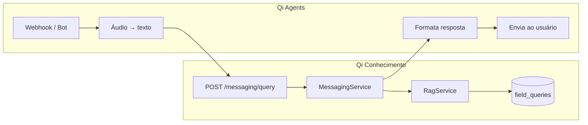
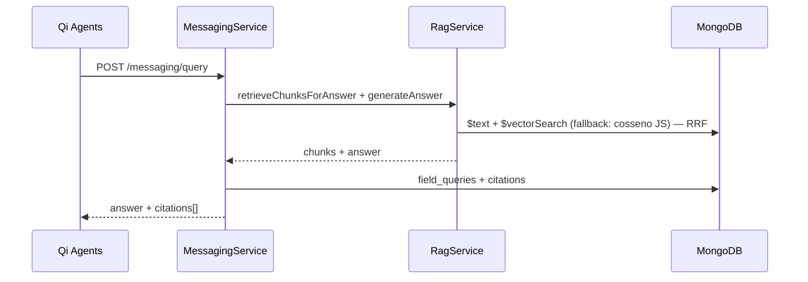

# Mensageria — Interface de Campo


## Objetivo


Entregar respostas técnicas no WhatsApp/Telegram com **citação rastreável** da norma ou documento de origem.


## Arquitetura com Qi Agents


Canais de mensageria (webhooks, áudio, envio) ficam no projeto **[Qi Agents](../integrations/qi-agents.md)**. Este repositório expõe apenas o **cérebro RAG**.





| Camada | Projeto | Responsabilidade |

| --- | --- | --- |

| Canal | Qi Agents | WhatsApp, Telegram, Whisper, Meta/Telegram API |

| RAG | Qi Conhecimento | Busca híbrida, LLM, citações, histórico |


## Fluxo em `POST /messaging/query`

Toda consulta RAG com resposta citada passa por `MessagingService.handleFieldQuery()` — incluindo `POST /knowledge/public-ask` (LP web) e testes no admin (`/search` → assistente).

| Entrada | Path | Canal (`field_queries.channel`) | Auth |
| --- | --- | --- | --- |
| Qi Agents (WhatsApp/Telegram) | `POST /messaging/query` | `whatsapp`, `telegram` | `X-Service-Key` ou JWT admin |
| Landing page (web) | `POST /knowledge/public-ask` | `web` | Público |
| Admin — modo assistente | `POST /messaging/query` | `admin` | JWT admin/editor |





1. Qi Agents envia `queryText`, `channel`, `externalUserId` (e opcionalmente `specialtyFilter`, `transcribedFromAudio`)

2. `RagService.retrieveChunksForAnswer()` — 1–2 buscas híbridas (texto + `$vectorSearch`) + fusão RRF

3. `RagService.generateAnswer()` — LLM Anthropic ou OpenAI com contexto dos chunks

4. `RagService.selectCitationsForDisplay()` — filtra e deduplica citações (ex.: Tabela H.1 em perguntas sobre K)

5. Fallback sem API key: template `"Conforme NBR X: excerpt..."`

6. Registro em `field_queries` com array de `citations` (filtradas por `selectCitationsForDisplay`)

   Também usado por `POST /knowledge/public-ask` (LP web, canal `web`) e testes no admin (canal `admin`).

7. Qi Agents formata `answer` + citações e envia ao canal


## Endpoints


| Método | Path | Descrição |

| --- | --- | --- |

| POST | `/messaging/query` | **Principal** — consulta RAG para canais (Qi Agents) e testes admin |
| GET | `/messaging/queries` | Histórico `field_queries` (admin/editor) — painel `/queries` |

| GET | `/messaging/whatsapp/webhook` | Legado — verificação Meta (não usar com Qi Agents) |

| POST | `/messaging/whatsapp/webhook` | Legado — stub (não usar com Qi Agents) |


Integração completa: [integrations/qi-agents.md](../integrations/qi-agents.md)


### Exemplo `POST /messaging/query`


```json

{

  "queryText": "Qual o recuo mínimo do tubo de esgoto?",

  "specialtyFilter": "hidraulica",

  "tagFilter": ["nbr 8160"],

  "documentIds": [],

  "channel": "whatsapp",

  "externalUserId": "5511999999999",

  "transcribedFromAudio": false

}

```

| Campo | Descrição |
| --- | --- |
| `tagFilter` | Restringe chunks às tags do documento (definidas na ingestão). Omita para busca ampla na especialidade. |
| `documentIds` | Restringe a documentos Mongo específicos. |

Resposta inclui `answer` e `citations[]` com `documentTitle`, `normReference`, `normItem`, `pageStart`, `excerpt`. O registro fica em `field_queries` e aparece no painel `/queries`.

### Canais em `field_queries`

| Valor | Origem |
| --- | --- |
| `whatsapp` | Qi Agents — WhatsApp |
| `telegram` | Qi Agents — Telegram |
| `web` | `POST /knowledge/public-ask` (LP pública) |
| `admin` | Painel admin — `/search` (modo assistente) |


## Variáveis de ambiente (Qi Conhecimento)


| Variável | Uso |

| --- | --- |

| `LLM_PROVIDER` | `anthropic` ou `openai` — auto-detecta pela key se omitido |

| `ANTHROPIC_API_KEY` | LLM Anthropic (default: `claude-haiku-4-5`) |

| `OPENAI_API_KEY` | LLM OpenAI ou embeddings/OCR |

| `LLM_MODEL` | Modelo chat (default conforme provedor) |

| `EMBEDDING_PROVIDER` | `ollama` ou `openai` — busca híbrida no RAG |

| `SERVICE_API_KEY` | Service key da integração Qi Agents (`X-Service-Key`). Vazio em dev = rota aberta |


Credenciais WhatsApp/Telegram (`WHATSAPP_*`, `TELEGRAM_*`) configuram-se no **Qi Agents**, não neste projeto.


## Pendências (Qi Conhecimento)


| Item | Status |

| --- | --- |

| `POST /messaging/query` | ✅ |

| Integração documentada com Qi Agents | ✅ |

| API key serviço-a-serviço (`X-Service-Key`) | ✅ |

| Admin `/queries` — histórico (`GET /messaging/queries`) | ✅ |


## Fora de escopo (Qi Conhecimento)


Absorvido pelo Qi Agents — não implementar aqui:


- Webhook POST funcional

- Fila `messaging` / job `send-field-response`

- Transcrição de áudio (Whisper)

- Bot Telegram nativo

- Envio via Meta Graph API


Ver [phase-3.md](../development/phase-3.md).

