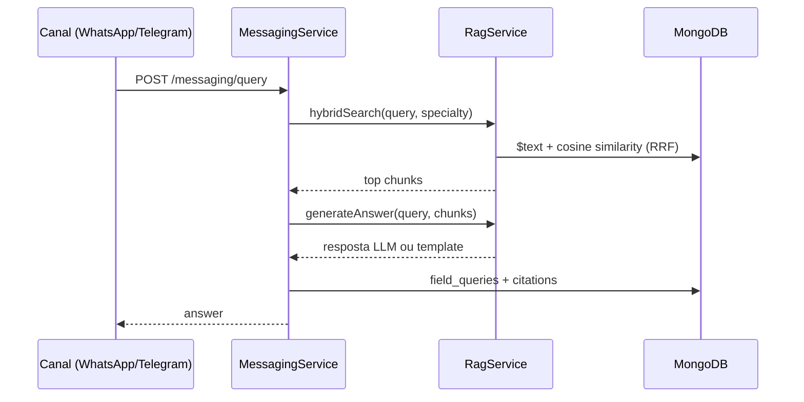

# Mensageria — Interface de Campo

## Objetivo

Entregar respostas técnicas no WhatsApp/Telegram com **citação rastreável** da norma ou documento de origem.

## Fluxo (implementado)



1. Consulta recebida (`queryText`, `specialtyFilter` opcional)
2. `RagService.hybridSearch()` — fusão RRF (texto + vetorial)
3. `RagService.generateAnswer()` — LLM OpenAI com contexto dos chunks
4. Fallback sem API key: template `"Conforme NBR X: excerpt..."`
5. Registro em `field_queries` com array de `citations`

## Endpoints

| Método | Path | Descrição |
| --- | --- | --- |
| POST | `/messaging/query` | Consulta RAG simulando canal de campo |
| GET | `/messaging/whatsapp/webhook` | Verificação Meta (hub challenge) |
| POST | `/messaging/whatsapp/webhook` | Recebimento de mensagens (stub) |

### Exemplo `POST /messaging/query`

```json
{
  "queryText": "Qual o recuo mínimo do tubo de esgoto?",
  "specialtyFilter": "hidraulica",
  "channel": "whatsapp",
  "externalUserId": "5511999999999"
}
```

Resposta inclui `answer` e `citations[]` com `documentTitle`, `normReference`, `excerpt`.

## Variáveis de ambiente

| Variável | Uso |
| --- | --- |
| `OPENAI_API_KEY` | LLM para respostas enriquecidas |
| `LLM_MODEL` | Modelo chat (default: `gpt-4o-mini`) |
| `WHATSAPP_VERIFY_TOKEN` | Verificação webhook Meta |
| `WHATSAPP_ACCESS_TOKEN` | Envio de mensagens (futuro) |
| `WHATSAPP_PHONE_NUMBER_ID` | ID do número WhatsApp (futuro) |
| `TELEGRAM_BOT_TOKEN` | Bot Telegram (futuro) |

## Pendências (Fase 3)

- Webhook POST funcional (parse + resposta automática)
- Fila `messaging` / job `send-field-response`
- Transcrição de áudio (Whisper)
- Bot Telegram
- Histórico de consultas no admin (`/queries`)
