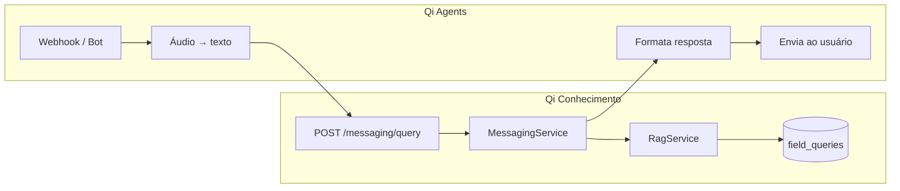
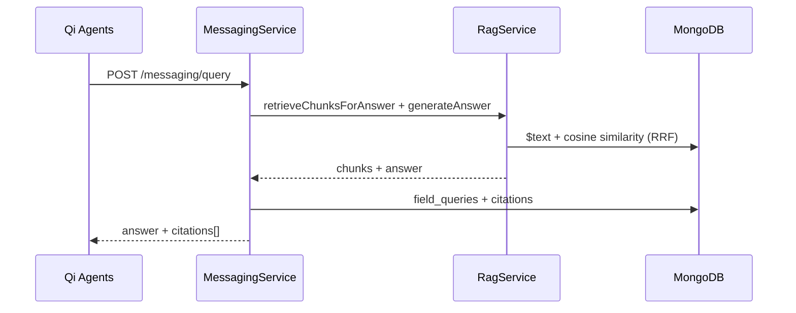

# Mensageria — Interface de Campo


## Objetivo


Entregar respostas técnicas no WhatsApp/Telegram com **citação rastreável** da norma ou documento de origem.


## Arquitetura com Qi Agents


Canais de mensageria (webhooks, áudio, envio) ficam no projeto **[Qi Agents](../integrations/qi-agents.md)**. Este repositório expõe apenas o **cérebro RAG**.





| Camada | Projeto | Responsabilidade |

| --- | --- | --- |

| Canal | Qi Agents | WhatsApp, Telegram, Whisper, Meta/Telegram API |

| RAG | Qi Conhecimento | Busca híbrida, LLM, citações, histórico |


## Fluxo em `POST /messaging/query`





1. Qi Agents envia `queryText`, `channel`, `externalUserId` (e opcionalmente `specialtyFilter`, `transcribedFromAudio`)

2. `RagService.retrieveChunksForAnswer()` — fusão RRF (texto + vetorial)

3. `RagService.generateAnswer()` — LLM Anthropic ou OpenAI com contexto dos chunks

4. Fallback sem API key: template `"Conforme NBR X: excerpt..."`

5. Registro em `field_queries` com array de `citations`

6. Qi Agents formata `answer` + citações e envia ao canal


## Endpoints


| Método | Path | Descrição |

| --- | --- | --- |

| POST | `/messaging/query` | **Principal** — consulta RAG para canais (Qi Agents) |

| GET | `/messaging/whatsapp/webhook` | Legado — verificação Meta (não usar com Qi Agents) |

| POST | `/messaging/whatsapp/webhook` | Legado — stub (não usar com Qi Agents) |


Integração completa: [integrations/qi-agents.md](../integrations/qi-agents.md)


### Exemplo `POST /messaging/query`


```json

{

  "queryText": "Qual o recuo mínimo do tubo de esgoto?",

  "specialtyFilter": "hidraulica",

  "channel": "whatsapp",

  "externalUserId": "5511999999999",

  "transcribedFromAudio": false

}

```


Resposta inclui `answer` e `citations[]` com `documentTitle`, `normReference`, `normItem`, `pageStart`, `excerpt`.


## Variáveis de ambiente (Qi Conhecimento)


| Variável | Uso |

| --- | --- |

| `LLM_PROVIDER` | `anthropic` ou `openai` — auto-detecta pela key se omitido |

| `ANTHROPIC_API_KEY` | LLM Anthropic (default: `claude-haiku-4-5`) |

| `OPENAI_API_KEY` | LLM OpenAI ou embeddings/OCR |

| `LLM_MODEL` | Modelo chat (default conforme provedor) |

| `EMBEDDING_PROVIDER` | `ollama` ou `openai` — busca híbrida no RAG |


Credenciais WhatsApp/Telegram (`WHATSAPP_*`, `TELEGRAM_*`) configuram-se no **Qi Agents**, não neste projeto.


## Pendências (Qi Conhecimento)


| Item | Status |

| --- | --- |

| `POST /messaging/query` | ✅ |

| Integração documentada com Qi Agents | ✅ |

| API key serviço-a-serviço | Planejado |

| Admin `/queries` — histórico | Planejado |


## Fora de escopo (Qi Conhecimento)


Absorvido pelo Qi Agents — não implementar aqui:


- Webhook POST funcional

- Fila `messaging` / job `send-field-response`

- Transcrição de áudio (Whisper)

- Bot Telegram nativo

- Envio via Meta Graph API


Ver [phase-3.md](../development/phase-3.md).

