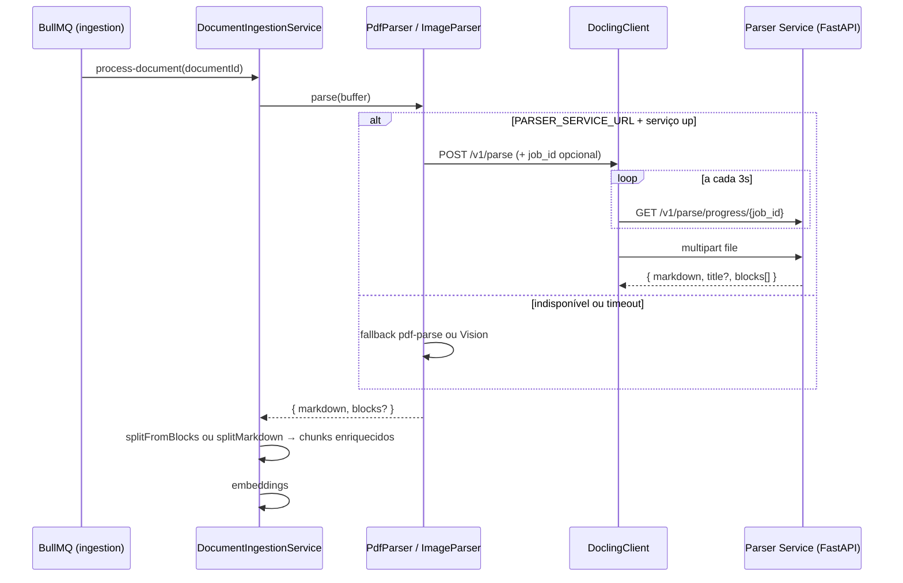

# Parser Service (FastAPI + Docling)

Microserviço Python que converte documentos técnicos (PDF, imagens) em **Markdown estruturado**, preservando tabelas e hierarquia de seções. A API NestJS chama via `DoclingClient` quando `PARSER_SERVICE_URL` está definido; faz **fallback automático** para `pdf-parse` / Vision API se indisponível ou em timeout.

> **Documentação completa:** evolução, pipeline, limitações e roadmap em [docling.md](./docling.md).

Código: [`apps/parser`](../../apps/parser/README.md).

## Por que um serviço separado

- Docling extrai layout, tabelas e OCR melhor que bibliotecas JS.
- Isola dependências pesadas (PyTorch, modelos ML) do runtime Node/NestJS.
- Open source (MIT) — roda 100% local.

## Arquitetura da integração



## Contrato HTTP

| Método | Rota | Descrição |
| --- | --- | --- |
| `GET` | `/health` | `{ "status": "ok", "engine": "docling" }` |
| `POST` | `/v1/parse` | `multipart/form-data` — campos `file`, opcional `do_ocr`, `job_id` |
| `GET` | `/v1/parse/progress/{job_id}` | Progresso (páginas, lote, mensagem) |

Resposta de `POST /v1/parse`:

```json
{
  "markdown": "...",
  "title": "NBR 8800",
  "engine": "docling",
  "blocks": [
    {
      "type": "table",
      "caption": "Tabela H.1 - Coeficiente de flambagem K...",
      "markdown": "| Caso | ... |",
      "pageStart": 142,
      "pageEnd": 142,
      "tableSource": "text_recovery",
      "headingPath": ["H.1 Na flambagem por flexão"]
    }
  ]
}
```

Campos de cada bloco em `blocks`:

| Campo | Tipo | Descrição |
| --- | --- | --- |
| `type` | `heading` \| `paragraph` \| `table` \| `list` | Tipo do bloco |
| `text` | string? | Texto (parágrafos/listas) |
| `markdown` | string? | Markdown (tabelas) |
| `level` | number? | Nível do heading (1–6) |
| `caption` | string? | Caption da tabela |
| `pageStart` / `pageEnd` | number? | Página(s) no PDF |
| `tableSource` | `docling` \| `text_recovery`? | Origem da tabela |
| `headingPath` | string[]? | Hierarquia de seções pai |

A API NestJS usa `blocks` para enriquecer chunks (`pageStart`, `tableCaption`, `contentType`, etc.) e melhorar citações no RAG.

Erros: `413`, `422`, `500` — ver [apps/parser/README.md](../../apps/parser/README.md).

## Variáveis de ambiente

### API (NestJS) — raiz `.env`

| Variável | Default | Uso |
| --- | --- | --- |
| `PARSER_SERVICE_URL` | *(vazio)* | URL do serviço. Vazio = parsers locais |
| `PARSER_SERVICE_TIMEOUT_MS` | `7200000` (2 h) | Timeout HTTP; a API usa o maior entre este valor e estimativa por tamanho (~8 min + ~4 min/MB) |
| `PARSER_MAX_UPLOAD_MB` | `150` | Deve coincidir com o limite do serviço parser |

### Serviço (`apps/parser`)

| Variável | Default | Uso |
| --- | --- | --- |
| `PARSER_PORT` | `8000` | Porta |
| `PARSER_MAX_UPLOAD_MB` | `150` | Limite de upload |
| `PARSER_DO_OCR` | `false` | OCR global em PDFs escaneados (lento; preferir reprocessamento sob demanda) |
| `PARSER_LOW_MEMORY` | `true` | Backend pypdfium2 — **ignorado** quando `PARSER_DO_TABLE_STRUCTURE=true` |
| `PARSER_PROFILE` | `default` | `default` \| `low_memory` \| `high_memory` |
| `PARSER_PAGE_BATCH_SIZE` | conforme perfil | Sobrescreve tamanho do lote |
| `PARSER_PARALLEL_WORKERS` | conforme perfil | Sobrescreve workers paralelos |
| `PARSER_DO_TABLE_STRUCTURE` | `true` | Extração de tabelas (TableFormer) |
| `PARSER_TABLE_MODE` | `accurate` | TableFormer: `accurate` ou `fast` |
| `PARSER_TABLE_CELL_MATCHING` | `true` | Casa células com texto do PDF |
| `PARSER_TABLE_IMAGE_RECOVERY` | `true` | Recupera tabelas exportadas como imagem via camada de texto |
| `PARSER_IMAGES_SCALE` | `1.0` | Escala das imagens de página (2.0 ≈ 4× RAM) |
| `PARSER_THREADS_PER_WORKER` | `0` (auto) | Threads torch por worker |

> **Paralelismo:** cada worker carrega sua própria cópia dos modelos Docling
> (~2–3 GB RAM). `PARSER_PARALLEL_WORKERS` no `.env` tem **prioridade** (sem downgrade automático).
> Com 2 workers + PDF longo + `pnpm dev` aberto, monitore RAM — ver [local-setup.md](../development/local-setup.md#stdbad_alloc--docling-oom-na-página-x).

### Perfis (`PARSER_PROFILE`)

Definidos no `.env` da raiz — lidos pelo `apps/parser` via `pnpm parser:dev` (`scripts/dev-parser.mjs` repassa todas as variáveis do `.env`).

| Perfil | RAM típica | Workers | Lote base | PDF 279 págs |
| --- | --- | --- | --- | --- |
| `default` | 8–16 GB | 1 (auto) | 8 → 4 | 1 worker, lote 4 |
| `low_memory` | ≤8 GB | 1 | 4 → 3 | 1 worker, lote 3 |
| `high_memory` | 16–32 GB | 2 | 12 → 8 | 2 workers, lote 8 |

`PARSER_PARALLEL_WORKERS` e `PARSER_PAGE_BATCH_SIZE` **sobrescrevem** o perfil.

## Como rodar

### Local (recomendado no Windows)

```bash
pnpm parser:setup    # venv + pip (Python 3.12)
pnpm parser:dev      # aguarde "Parser service pronto"
curl http://localhost:8000/health
```

Primeira subida baixa modelos Docling (~1 GB). **Não** rode Docker e `parser:dev` na mesma porta 8000.

`pnpm parser:dev` carrega o `.env` da raiz do monorepo e repassa `PARSER_PROFILE`, `PARSER_PARALLEL_WORKERS`, `PARSER_PAGE_BATCH_SIZE` e demais variáveis `PARSER_*` ao processo Python. No log de subida aparecem perfil e paralelismo efetivos.

### Docker (opcional)

```bash
pnpm parser:docker
# ou: docker compose -f infra/docker-compose.dev.yml --profile parser up -d --build parser
```

Build pesado (10–30 min). Profile `parser` no compose — não sobe com `docker compose up` padrão.

### Stack completa

```bash
pnpm infra:up
pnpm dev:all         # API + admin + web + parser
```

Defina `PARSER_SERVICE_URL=http://localhost:8000` no `.env` e reinicie a API.

## Comportamento em PDFs grandes

- PDFs acima de `PARSER_PAGE_BATCH_SIZE` páginas são processados em **lotes** com um único `DocumentConverter` (evita recarregar modelos a cada lote).
- A API envia `job_id` e faz poll de `/v1/parse/progress/{job_id}` para atualizar o console admin (página X/Y, lote N/M).
- Em timeout, `PdfParser` cai automaticamente para `pdf-parse` (texto inferior, mas ingestão não falha).

## Próximos passos

Ver roadmap em [docling.md](./docling.md#próximos-passos). Itens já entregues (metadados `blocks` → chunks, citações RAG enriquecidas) estão documentados em [knowledge-rag.md](./knowledge-rag.md).

Prioridades imediatas:

- Health check do parser no boot da API com aviso quando indisponível
- Badge no admin quando ingestão caiu em fallback `pdf-parse`
- Boost de retrieval por `contentType=table` em perguntas numéricas (além do rerank heurístico atual)
- Expandir `apps/api/eval/rag-cases.json` ao importar novas normas
