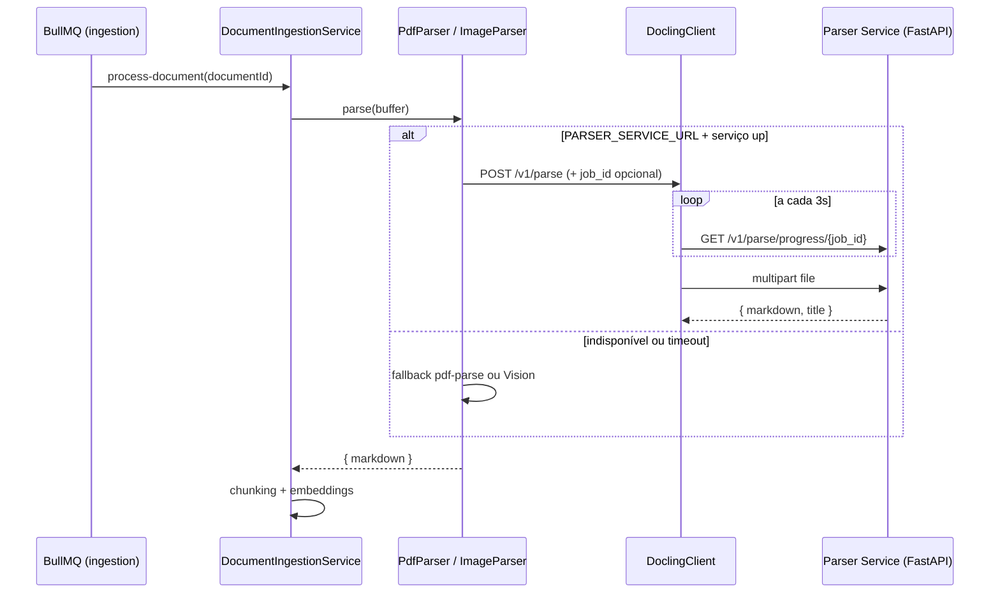

# Parser Service (FastAPI + Docling)

Microserviço Python que converte documentos técnicos (PDF, imagens) em **Markdown estruturado**, preservando tabelas e hierarquia de seções. A API NestJS chama via `DoclingClient` quando `PARSER_SERVICE_URL` está definido; faz **fallback automático** para `pdf-parse` / Vision API se indisponível ou em timeout.

Código: [`apps/parser`](../../apps/parser/README.md).

## Por que um serviço separado

- Docling extrai layout, tabelas e OCR melhor que bibliotecas JS.
- Isola dependências pesadas (PyTorch, modelos ML) do runtime Node/NestJS.
- Open source (MIT) — roda 100% local.

## Arquitetura da integração



## Contrato HTTP

| Método | Rota | Descrição |
| --- | --- | --- |
| `GET` | `/health` | `{ "status": "ok", "engine": "docling" }` |
| `POST` | `/v1/parse` | `multipart/form-data` — campos `file`, opcional `do_ocr`, `job_id` |
| `GET` | `/v1/parse/progress/{job_id}` | Progresso do parse (páginas, lote atual) |

Resposta de parse: `{ "markdown", "title?", "engine?" }`.

Erros: `413`, `422`, `500` — ver [apps/parser/README.md](../../apps/parser/README.md).

## Variáveis de ambiente

### API (NestJS) — raiz `.env`

| Variável | Default | Uso |
| --- | --- | --- |
| `PARSER_SERVICE_URL` | *(vazio)* | URL do serviço. Vazio = parsers locais |
| `PARSER_SERVICE_TIMEOUT_MS` | `7200000` (2 h) | Timeout HTTP; a API usa o maior entre este valor e estimativa por tamanho (~8 min + ~4 min/MB) |
| `PARSER_MAX_UPLOAD_MB` | `150` | Deve coincidir com o limite do serviço parser |

### Serviço (`apps/parser`)

| Variável | Default | Uso |
| --- | --- | --- |
| `PARSER_PORT` | `8000` | Porta |
| `PARSER_MAX_UPLOAD_MB` | `150` | Limite de upload |
| `PARSER_DO_OCR` | `false` | OCR global em PDFs escaneados (lento; preferir reprocessamento sob demanda) |
| `PARSER_LOW_MEMORY` | `true` | Backend pypdfium2 — evita OOM em normas longas |
| `PARSER_PAGE_BATCH_SIZE` | `15` | Páginas por lote (`0` = arquivo inteiro). Conversor Docling é **reutilizado** entre lotes |
| `PARSER_DO_TABLE_STRUCTURE` | `true` | Extrai estrutura de tabelas |
| `PARSER_TABLE_MODE` | `accurate` | TableFormer: `accurate` ou `fast` |
| `PARSER_TABLE_CELL_MATCHING` | `true` | Casa células com texto do PDF |

## Como rodar

### Local (recomendado no Windows)

```bash
pnpm parser:setup    # venv + pip (Python 3.12)
pnpm parser:dev      # aguarde "Parser service pronto"
curl http://localhost:8000/health
```

Primeira subida baixa modelos Docling (~1 GB). **Não** rode Docker e `parser:dev` na mesma porta 8000.

`parser:dev` repassa `PARSER_LOW_MEMORY` e `PARSER_PAGE_BATCH_SIZE` do ambiente (não lê `.env` automaticamente — exporte ou defina no shell se precisar).

### Docker (opcional)

```bash
pnpm parser:docker
# ou: docker compose -f infra/docker-compose.dev.yml --profile parser up -d --build parser
```

Build pesado (10–30 min). Profile `parser` no compose — não sobe com `docker compose up` padrão.

### Stack completa

```bash
pnpm infra:up
pnpm dev:all         # API + admin + web + parser
```

Defina `PARSER_SERVICE_URL=http://localhost:8000` no `.env` e reinicie a API.

## Comportamento em PDFs grandes

- PDFs acima de `PARSER_PAGE_BATCH_SIZE` páginas são processados em **lotes** com um único `DocumentConverter` (evita recarregar modelos a cada lote).
- A API envia `job_id` e faz poll de `/v1/parse/progress/{job_id}` para atualizar o console admin (página X/Y, lote N/M).
- Em timeout, `PdfParser` cai automaticamente para `pdf-parse` (texto inferior, mas ingestão não falha).

## Próximos passos

- Expor `pages`/metadados de tabela no contrato para enriquecer chunks
- Health check do parser no boot da API com aviso quando indisponível
