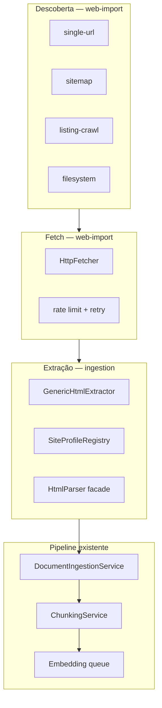
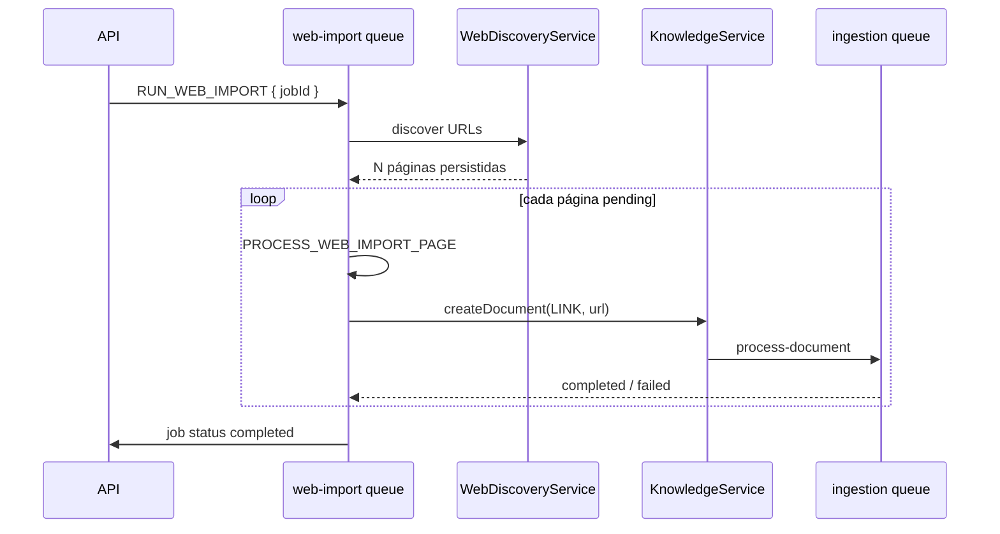

# Importação web genérica

Estratégia para importar conhecimento de sites, help centers e pastas HTML locais — reutilizando o pipeline RAG existente (parse → chunk → embed).

> Casos de uso: artigo avulso, base Zendesk, manual Eberick (`.htm`), documentação de fabricante, blogs técnicos.

## Visão em camadas



| Camada | Módulo | Responsabilidade |
| --- | --- | --- |
| Descoberta + orquestração | `web-import` | Jobs em lote, enumeração de URLs, progresso |
| Fetch | `web-import` | HTTP, timeouts, política de domínio |
| Extração HTML | `ingestion` | Readability + perfis → `ParseResult` com `blocks[]` |
| Ingestão | `ingestion` + `knowledge` | Inalterado conceitualmente |

---

## Fases de entrega

| Fase | Escopo | Entrega visível |
| --- | --- | --- |
| **1** ✅ | Extrator HTML genérico + `blocks[]` | `import-link` melhora em qualquer URL |
| **2** ✅ | `WebImportJob` + descoberta + settings no admin | Admin “Importar site” |
| **3** | Perfis declarativos (YAML) + auto-detect | Eberick, Zendesk, etc. sem código no core |
| **4** | Sync incremental (etag, diff) | Reimportação seletiva |

Este documento detalha **Fase 1** (fundação) e antecipa contratos das **Fases 2–3**.

---

## Estrutura de pastas

### API — módulo `web-import` (Fase 2+)

```
apps/api/src/modules/web-import/
├── web-import.module.ts
├── controllers/
│   └── web-import.controller.ts       # REST + SSE progresso do job
├── services/
│   ├── web-import.service.ts            # CRUD jobs, cancel, retry
│   ├── web-discovery.service.ts         # orquestra estratégias de descoberta
│   └── web-fetch.service.ts             # fetch URL com rate limit (extrai de StorageService)
├── discovery/
│   ├── discovery.interface.ts           # WebDiscoveryStrategy
│   ├── single-url.discovery.ts
│   ├── sitemap.discovery.ts
│   ├── listing-crawl.discovery.ts       # BFS a partir de seed + seletor de links
│   └── filesystem.discovery.ts          # pasta local .htm/.html
├── processors/
│   └── web-import.processor.ts          # BullMQ: discover → fetch → create documents
├── repositories/
│   └── web-import.repository.ts
├── schemas/
│   ├── web-import-job.schema.ts
│   └── web-import-page.schema.ts
└── dtos/
    └── web-import.dto.ts
```

### API — evolução do módulo `ingestion` (Fase 1)

```
apps/api/src/modules/ingestion/
├── parsers/
│   ├── html.parser.ts                   # facade fina — delega ao extrator
│   └── html/                            # NOVO
│       ├── html-extractor.interface.ts
│       ├── generic-html.extractor.ts    # Readability + DOM walk → blocks[]
│       ├── profile-html.extractor.ts    # seletores do perfil (Fase 3)
│       ├── html-extractor.factory.ts    # escolhe genérico vs perfil
│       ├── html-to-blocks.util.ts       # cheerio → ParseBlock[]
│       └── html-to-markdown.util.ts     # turndown / serialização
├── profiles/                            # Fase 3
│   ├── site-profile.interface.ts
│   ├── site-profile.registry.ts
│   └── definitions/
│       ├── zendesk.profile.yaml
│       ├── eberick-help.profile.yaml
│       └── generic-fallback.profile.yaml
└── utils/
    └── parse-quality.util.ts            # estender para HTML/LINK
```

### Pacotes compartilhados

```
packages/shared-types/src/
├── index.ts                             # + WebImport* enums/interfaces
└── web-import.ts                        # tipos do job (opcional, separar arquivo)

packages/shared-validators/src/
└── index.ts                             # + createWebImportJobSchema, etc.

packages/api-client/src/
└── index.ts                             # + webImport.* methods

apps/admin/src/
├── app/(panel)/web-import/page.tsx      # Fase 2
├── containers/WebImportPage.tsx
└── containers/WebImportJobDetailPage.tsx
```

---

## Contratos TypeScript (`shared-types`)

### Fase 1 — extração (sem job ainda)

Sem mudança em `DocumentSourceType`. O `HtmlParser` passa a retornar `blocks[]` quando possível.

```typescript
// packages/shared-types/src/web-import.ts

export enum WebDiscoveryStrategy {
  SINGLE_URL = 'single_url',
  SITEMAP = 'sitemap',
  LISTING_CRAWL = 'listing_crawl',
  FILESYSTEM = 'filesystem',
}

export enum WebImportJobStatus {
  PENDING = 'pending',
  DISCOVERING = 'discovering',
  IMPORTING = 'importing',
  COMPLETED = 'completed',
  FAILED = 'failed',
  CANCELLED = 'cancelled',
}

export enum WebImportPageStatus {
  PENDING = 'pending',
  FETCHING = 'fetching',
  INGESTING = 'ingesting',
  COMPLETED = 'completed',
  SKIPPED = 'skipped',   // duplicata, fora do escopo, robots
  FAILED = 'failed',
}

export interface WebImportJobConfig {
  seedUrl: string;
  discovery: WebDiscoveryStrategy;
  /** ID do perfil de extração; omitido = auto-detect + genérico */
  profileId?: string;
  maxPages?: number;           // default 500
  maxDepth?: number;           // listing_crawl, default 3
  sameOriginOnly?: boolean;    // default true
  pathPrefix?: string;         // ex.: /hc/pt-br/articles/
  tags?: string[];
  rateLimitMs?: number;        // default 1000 entre fetches
}

export interface WebImportJob {
  id: string;
  title: string;
  specialty: EngineeringSpecialty;
  config: WebImportJobConfig;
  status: WebImportJobStatus;
  pagesDiscovered: number;
  pagesCompleted: number;
  pagesFailed: number;
  createdAt: string;
  updatedAt: string;
}

export interface WebImportPage {
  id: string;
  jobId: string;
  url: string;
  title?: string;
  status: WebImportPageStatus;
  documentId?: string;
  error?: string;
}
```

### Interface do extrator (ingestion)

```typescript
// apps/api/src/modules/ingestion/parsers/html/html-extractor.interface.ts

export interface HtmlExtractContext {
  url?: string;
  profileId?: string;
}

export interface HtmlExtractor {
  /** Identificador estável — ex.: 'generic', 'zendesk', 'eberick-help' */
  readonly id: string;

  /** 0–1; usado pelo factory para auto-detect */
  matchScore?(url: string, html: string): number;

  extract(html: string, context: HtmlExtractContext): Promise<ParseResult>;
}
```

### Perfil de site (Fase 3)

```typescript
export interface SiteProfile {
  id: string;
  label: string;
  match: { hostPattern?: string; pathPattern?: string };
  selectors: {
    title?: string;
    content: string;
    exclude?: string[];
    nextPage?: string;       // paginação listing
    articleLinks?: string;   // links na página de índice
  };
  discovery?: {
    strategy: WebDiscoveryStrategy;
    startUrlTemplate?: string;
  };
}
```

Exemplo YAML (`eberick-help.profile.yaml`):

```yaml
id: eberick-help
label: AltoQi Eberick — Ajuda HTML
match:
  pathPattern: "\\.htm(l)?$"
selectors:
  title: "title, h1"
  content: "body"
  exclude: ["script", "style", "nav"]
discovery:
  strategy: filesystem
```

---

## API REST

Prefixo: `/knowledge/web-imports` (sob o guard JWT + roles `admin` | `editor`).

### Fase 1 — sem endpoints novos

`POST /knowledge/documents/import-link` continua igual; o ganho é interno (melhor parse).

Resposta do documento pode incluir (futuro):

```json
{
  "parseEngine": "html-readability",
  "extractorId": "generic"
}
```

### Fase 2 — jobs de importação

| Método | Rota | Descrição |
| --- | --- | --- |
| `POST` | `/knowledge/web-imports` | Cria job e enfileira descoberta |
| `GET` | `/knowledge/web-imports` | Lista jobs (`page`, `limit`) |
| `GET` | `/knowledge/web-imports/:jobId` | Detalhe + contadores |
| `GET` | `/knowledge/web-imports/:jobId/pages` | Páginas do job (`status` filter) |
| `GET` | `/knowledge/web-imports/:jobId/progress` | Snapshot de progresso (sem SSE) |
| `GET` | `/knowledge/web-imports/:jobId/stream` | SSE — progresso (espelha ingestion-stream) |
| `POST` | `/knowledge/web-imports/:jobId/cancel` | Cancela job + páginas pendentes |
| `POST` | `/knowledge/web-imports/:jobId/retry-failed` | Reenfileira páginas `failed` |

#### `POST /knowledge/web-imports`

```json
{
  "title": "Manual Eberick 2025",
  "specialty": "civil",
  "normReference": null,
  "author": "AltoQi",
  "tags": ["eberick", "altoqi"],
  "config": {
    "seedUrl": "https://suporte.altoqi.com.br/hc/pt-br/altoqi-eberick",
    "discovery": "listing_crawl",
    "profileId": "zendesk",
    "maxPages": 600,
    "maxDepth": 2,
    "sameOriginOnly": true,
    "pathPrefix": "/hc/pt-br/articles/",
    "rateLimitMs": 800
  }
}
```

**201:**

```json
{
  "id": "66f…",
  "status": "pending",
  "pagesDiscovered": 0,
  "pagesCompleted": 0,
  "pagesFailed": 0
}
```

#### `GET /knowledge/web-imports/:jobId/stream` (SSE)

Eventos (mesmo padrão de `ingestion-stream`):

| Evento | Payload |
| --- | --- |
| `phase` | `{ phase, message, percent }` |
| `page` | `{ url, status, documentId? }` |
| `done` | `{ status, pagesCompleted, pagesFailed }` |
| `error` | `{ message }` |

### Fase 3 — perfis

| Método | Rota | Descrição |
| --- | --- | --- |
| `GET` | `/knowledge/web-imports/profiles` | Lista perfis disponíveis |
| `POST` | `/knowledge/web-imports/profiles/detect` | `{ url }` → `{ profileId, score }` |

---

## Modelos MongoDB

### `web_import_jobs`

| Campo | Tipo | Notas |
| --- | --- | --- |
| `title` | string | Nome do lote |
| `specialty` | enum | |
| `normReference`, `author` | string? | Herdados pelos documentos filhos |
| `tags` | string[] | Aplicadas a cada documento |
| `config` | subdoc | `WebImportJobConfig` |
| `status` | enum | `WebImportJobStatus` |
| `pagesDiscovered` | number | |
| `pagesCompleted` | number | |
| `pagesFailed` | number | |
| `pagesSkipped` | number | Duplicatas ou fora de filtros |
| `documentId` | ObjectId? | Documento único quando `discovery: single_url` |
| `error` | string? | Falha fatal do job |
| `deletedAt` | Date? | soft delete |

### `web_import_pages`

| Campo | Tipo | Notas |
| --- | --- | --- |
| `jobId` | ObjectId | índice |
| `url` | string | único por job |
| `canonicalUrl` | string? | normalizada |
| `title` | string? | título extraído ou da descoberta |
| `status` | enum | `WebImportPageStatus` |
| `documentId` | ObjectId? | `knowledge_documents` criado |
| `error` | string? | |
| `contentHash` | string? | Fase 4 — diff |

Índices: `{ jobId: 1, url: 1 }` unique; `{ jobId: 1, status: 1 }`.

### `knowledge_documents` — extensão opcional (Fase 2)

| Campo novo | Tipo | Notas |
| --- | --- | --- |
| `webImportJobId` | ObjectId? | rastreio do lote |
| `webImportPageId` | ObjectId? | |
| `extractorId` | string? | `generic`, `zendesk`, … |

---

## Filas BullMQ

```typescript
// apps/api/src/queues/queues.constants.ts — adições

export const QUEUE_NAMES = {
  // …existentes
  WEB_IMPORT: 'web-import',
} as const;

export const JOB_NAMES = {
  // …existentes
  RUN_WEB_IMPORT: 'run-web-import',
  PROCESS_WEB_IMPORT_PAGE: 'process-web-import-page',
};
```

### Fluxo do worker `web-import`



- **Concorrência `web-import`:** 1 (descoberta sequencial, respeita rate limit).
- **Concorrência `ingestion`:** mantém 1; páginas enfileiram `process-document` como hoje.
- **Rate limit:** `WebFetchService` com delay configurável entre GETs do mesmo job.

---

## Fase 1 — implementação do extrator genérico

### Dependências novas (`apps/api`)

```bash
pnpm --filter @qi-conhecimento/api add @mozilla/readability turndown jsdom
pnpm --filter @qi-conhecimento/api add -D @types/turndown
```

> `jsdom` alimenta o Readability no Node. Alternativa futura: `linkedom` (mais leve).

### Algoritmo `GenericHtmlExtractor`

1. Parse HTML com cheerio/jsdom.
2. **Readability** → fragmento do artigo principal.
3. **DOM walk** no fragmento → `ParseBlock[]`:
   - `h1`–`h6` → `heading` (+ `level`, `headingPath` acumulado)
   - `p` → `paragraph`
   - `table` → `table` (+ markdown da tabela)
   - `ul`/`ol` → `list`
4. **Turndown** no fragmento → `markdown` (fallback coerente com blocks).
5. `title` ← Readability title ou primeiro `h1`.
6. `engine` ← `'html-readability'`.

### `HtmlParser` (facade)

```typescript
@Injectable()
export class HtmlParser implements DocumentParser {
  constructor(private readonly extractorFactory: HtmlExtractorFactory) {}

  async parse(input: Buffer | string, options?: ParseOptions): Promise<ParseResult> {
    const html = Buffer.isBuffer(input) ? input.toString('utf-8') : input;
    const extractor = this.extractorFactory.resolve({
      url: options?.sourceUrl,
      profileId: options?.profileId,
      html,
    });
    return extractor.extract(html, { url: options?.sourceUrl });
  }
}
```

Estender `ParseOptions`:

```typescript
export interface ParseOptions {
  // …existentes
  sourceUrl?: string;
  profileId?: string;
}
```

`DocumentIngestionService.loadSource` já tem a URL em `sourceReference` — passar para o parser.

### Chunking

Quando `parseResult.blocks?.length`:

```typescript
const segments = parseBlocks?.length
  ? this.chunkingService.splitFromBlocks(parseBlocks, document.title)
  : this.chunkingService.splitMarkdown(markdown, document.title);
```

(lógica já existe para PDF/Docling — reutilizar o mesmo branch para HTML.)

### Qualidade de parse (HTML)

Estender `assessParseQuality` para `LINK` / `HTML`:

| Heurística | Ação |
| --- | --- |
| `< 200` caracteres extraídos | `suspicious: true` |
| Razão texto/HTML > 0.9 (página só navegação) | aviso |
| Sem `blocks` e sem headings no markdown | sugerir perfil customizado |

---

## Integração com código existente

| Arquivo atual | Mudança |
| --- | --- |
| `storage.service.ts` | `fetchUrl` → mover lógica HTTP para `WebFetchService`; manter wrapper |
| `html.parser.ts` | Delegar ao `HtmlExtractorFactory` |
| `document-ingestion.service.ts` | Passar `sourceReference` como `sourceUrl`; usar `blocks` do HTML |
| `parser.factory.ts` | Sem mudança |
| `import-link` endpoint | Sem mudança na API (Fase 1) |
| `parse-quality.util.ts` | Regras HTML |

---

## Admin (Fase 2)

| Rota | UI |
| --- | --- |
| `/web-import` | Formulário: título, especialidade, seed URL, estratégia, perfil, limites |
| `/web-import/:jobId` | Tabela de páginas + barra de progresso + link para documentos |

Reutilizar padrões de `IngestionConsoleModal` e `useIngestionStream` para SSE do job.

---

## Configurações (admin)

Persistidas em MongoDB (`web_import_settings`) e editáveis em **Admin → Importar site**.

| Campo | Default | Descrição |
| --- | --- | --- |
| `maxPages` | `500` | Teto de páginas por job (default) |
| `maxDepth` | `3` | Profundidade BFS (default) |
| `rateLimitMs` | `1000` | Delay entre fetches |
| `fetchTimeoutMs` | `30000` | Timeout por URL |
| `userAgent` | `QiConhecimento/1.0…` | User-Agent HTTP |

| Método | Rota | Descrição |
| --- | --- | --- |
| `GET` | `/knowledge/web-imports/settings` | Lê configurações |
| `PATCH` | `/knowledge/web-imports/settings` | Atualiza (somente `admin`) |

> Não há variáveis de ambiente para estes valores — altere pelo admin.

### Estratégias de descoberta (implementadas)

| Valor | Descrição |
| --- | --- |
| `single_url` | Uma URL — importa artigo/página avulsa |
| `sitemap` | Lê `sitemap.xml` (ou índice) e filtra por `pathPrefix` / `sameOriginOnly` |
| `listing_crawl` | BFS a partir da seed — ideal para help centers (Zendesk, etc.) |
| `filesystem` | **Não implementado** — reservado para HTML local (Fase 3) |

---

## Operação e troubleshooting

### Parar filas BullMQ

Jobs de web-import disparam ingestão + embeddings por página. Para **interromper tudo**:

```bash
pnpm purge:queues          # ingestion + embedding + web-import
pnpm purge:embedding       # só embeddings
pnpm purge:web-import        # só descoberta/importação web
pnpm purge:ingestion         # só parse/chunking (legado)
```

> Jobs **ativos** podem terminar o chunk/página atual antes de parar. Reinicie a API (`pnpm dev`) se quiser garantir parada imediata.

### Limpar dados de um job no MongoDB

Scripts em `apps/api/scripts/`:

| Comando | Descrição |
| --- | --- |
| `pnpm cleanup:web-import -- --seed=altoqi-eberick` | Apaga jobs, páginas, documentos e chunks por padrão no seed/título (Mongo direto) |
| `pnpm cleanup:web-import:api -- --seed=altoqi-eberick` | Idem via REST (API precisa estar no ar) |
| `pnpm cleanup:web-import -- --dry-run` | Lista o que seria apagado |

### Fluxo típico no admin

1. **Importar site** → http://localhost:3102/web-import
2. Ajuste **configurações globais** (max páginas, depth, rate limit) no topo da tela
3. Crie job: título, especialidade, seed URL, estratégia (`listing_crawl` para help center)
4. Acompanhe em `/web-import/{jobId}` — barra de progresso + tabela de páginas
5. Documentos gerados aparecem em **Documentos** com `sourceType: link`
6. Embeddings rodam na fila `embedding` — badge `embedding ✓` nas pílulas

### Collections MongoDB

- `web_import_jobs` — lote
- `web_import_pages` — URL descoberta + status + `documentId`
- `web_import_settings` — defaults globais (editável no admin)

---

## Ordem de implementação

### Sprint 1 — Fase 1 ✅

Extrator Readability, `HtmlParser` facade, chunking por `blocks[]`, qualidade HTML, testes Jest.

### Sprint 2 — Fase 2 ✅

Módulo `web-import`, discovery, BullMQ, REST + SSE, admin `/web-import`, settings no MongoDB.

### Sprint 3 — Fase 3 (próximo)

1. Loader YAML + `ProfileHtmlExtractor`.
2. Perfis `zendesk`, `eberick-help`.
3. `POST /profiles/detect`.

---

## Fixtures de teste recomendadas

Salvar em `apps/api/src/modules/ingestion/parsers/html/__fixtures__/`:

| Arquivo | Representa |
| --- | --- |
| `zendesk-article.html` | Artigo suporte AltoQi |
| `generic-blog.html` | Post com sidebar |
| `help-legacy.htm` | HTML antigo estilo RoboHelp |
| `spa-shell.html` | Div vazia + JS (deve falhar qualidade → Fase 3 headless) |

---

## Referências

- Pipeline atual: [knowledge-rag.md](./knowledge-rag.md)
- Endpoints existentes: [api.md](./api.md)
- Padrões BullMQ / soft delete: [patterns.md](./patterns.md)
