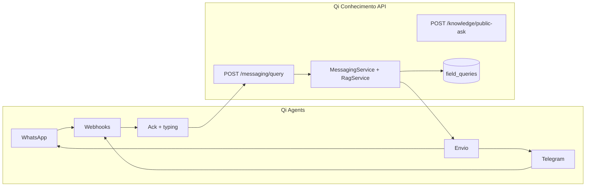

# Integração Qi Agents ↔ Qi Conhecimento

O **Qi Agents** é o projeto responsável por **canais de mensageria** (WhatsApp, Telegram): webhooks, transcrição de áudio, formatação e envio de respostas.

O **Qi Conhecimento** expõe o **cérebro RAG** via `POST /messaging/query` — busca híbrida, LLM e persistência em `field_queries`.

> Não duplique webhooks Meta/Telegram no qi-conhecimento. Configure um canal no qi-agents apontando para a API de conhecimento.

## Divisão de responsabilidades

| Responsabilidade | Qi Agents | Qi Conhecimento |
| --- | --- | --- |
| Webhook WhatsApp / Telegram | ✅ | ❌ (stubs legados, não usar) |
| Ack + typing durante consulta lenta | ✅ | ❌ |
| Transcrição de áudio (Whisper etc.) | ✅ | ❌ |
| Envio de mensagem ao usuário | ✅ | ❌ |
| RAG (busca + LLM + citações) | ❌ | ✅ |
| Ingestão de normas/PDFs | ❌ | ✅ (`apps/admin`) |
| Histórico `field_queries` | ❌ (opcional espelhar) | ✅ |
| Admin `/queries` | ❌ | ✅ |

## Arquitetura



> `public-ask` (Modo A) também persiste em `field_queries` (canal `web`). Para WhatsApp/Telegram com `channel` + `externalUserId` corretos, use Modo B (`/messaging/query`).

## Configuração no Qi Agents

Há **dois modos** de integração. O modo recomendado para agentes normativos (Telegram/WhatsApp com Claude + tools) usa **API Source dinâmica** e pass-through.

### Modo A — API Source + tool (recomendado)

Cadastre no admin do qi-agents (**Integrações → API Source**):

| Campo | Valor |
| --- | --- |
| Nome | Qi Conhecimento API |
| `baseUrl` | `https://<api-qi-conhecimento>` ou `http://localhost:3100` (dev) |
| `timeoutMs` | **120000** — `public-ask` leva ~20–90s (Render free + LLM); use ack/typing no qi-agents |
| Endpoint `toolName` | ex. `consultar_norma_campo` (recomendado) ou `consultar_norma` |
| Path | `POST /messaging/query` (recomendado) ou `POST /knowledge/public-ask` |
| Body | `queryText` + `specialtyFilter` (campo) ou `query` + `specialty` (public-ask) |
| `passThroughResponse` | **true** — repassa o campo `answer` sem 2ª passagem do Claude |

Vincule a source ao agente via **`apiSourceIds`**. Documentação completa no repositório qi-agent: `docs/architecture/api-tools.md`.

**Seed automatizado (qi-agent)** — cria endpoints + agente; **URL e chave configure no admin**:

```bash
pnpm --filter @qi/api seed:admin          # 1ª vez — copie DEFAULT_WORKSPACE_ID para .env
pnpm --filter @qi/api seed:qiconhecimento # tools + agente (não substitui URL/auth já cadastradas)
```

No **qi-agent → Integrações → Qi Conhecimento API**: `baseUrl`, autenticação **API Key** com header `X-Service-Key` (mesmo valor que `SERVICE_API_KEY` no qi-conhecimento, se usar `/messaging/query`).

**Resposta da API (`public-ask`):**

```json
{
  "query": "...",
  "answer": "Conforme NBR 8800, Tabela H.1...",
  "citations": [{ "normReference": "NBR 8800", "pageStart": 142, ... }]
}
```

Com pass-through, o texto de `answer` vai direto ao canal. Sem pass-through, o Claude pode parafrasear ou distorcer valores normativos.

### RAG obrigatório (orquestrador + tool_choice)

Para **normas, manual Eberick e conteúdo técnico**, o prompt do canal **não basta** — o Claude pode responder do conhecimento geral. Configure no **qi-agent**:

| Campo (Agent) | Valor recomendado |
| --- | --- |
| `ragOnly` | `true` |
| `requiredRagTool` | `consultar_norma_campo` |
| `apiSourceIds` | Qi Conhecimento API |
| `disabledTools` | `["consultar_norma"]` (opcional — evita public-ask sem auditoria de canal) |

Endpoint da tool no admin:

| Campo | Valor |
| --- | --- |
| `toolName` | `consultar_norma_campo` |
| Path | `POST /messaging/query` |
| `passThroughResponse` | **true** |
| Auth da source | API Key, header `X-Service-Key` |

Comportamento:

1. Pergunta técnica → qi-agent força `tool_choice` → chama `/messaging/query` → RAG no qi-conhecimento.
2. Resposta com `passThroughResponse` → texto de `answer` vai direto ao Telegram/WhatsApp.
3. Registro em **Consultas de campo** (`/queries`) no admin qi-conhecimento.
4. Saudações curtas ("oi", "obrigado") → orquestrador responde sem tool (UX social).

Reaplicar seed após deploy:

```bash
pnpm --filter @qi/api seed:qiconhecimento
```

Documentação no qi-agent: `docs/architecture/api-tools.md` (seção **Modo RAG obrigatório**).

**Latência e UX:** enquanto a API responde, o qi-agents envia ack imediato (*"Recebi sua pergunta…"*) e indicador de digitação (Telegram + WhatsApp). Ver `architecture/channels.md` no qi-agents.

### Modo B — `POST /messaging/query` (legado / canais simples)

1. Crie um canal (WhatsApp ou Telegram) no qi-agents.
2. Aponte o **backend HTTP** para a API de conhecimento:

| Ambiente | URL |
| --- | --- |
| Local | `http://localhost:3100/messaging/query` |
| Produção | `https://<sua-api>/messaging/query` |

3. Mapeie a mensagem do usuário para o body JSON abaixo.
4. Use `answer` + `citations[]` da resposta para montar a mensagem enviada ao canal.

### Contrato de request (modo B — `/messaging/query`)

```json
{
  "queryText": "Qual o recuo mínimo do tubo de esgoto?",
  "channel": "whatsapp",
  "externalUserId": "5511999999999",
  "specialtyFilter": "hidraulica",
  "transcribedFromAudio": false
}
```

| Campo | Obrigatório | Descrição |
| --- | --- | --- |
| `queryText` | Sim | Pergunta (3–2000 caracteres) |
| `channel` | Sim | `whatsapp`, `telegram`, `web`, `admin` |
| `externalUserId` | Sim | ID do usuário no canal (telefone, chat id) |
| `specialtyFilter` | Não | `civil`, `hidraulica`, `eletrica`, `seguranca_trabalho` |
| `tagFilter` | Não | Tags para restringir chunks (ex.: `["eberick"]` para manual AltoQi) |
| `documentIds` | Não | Ids Mongo de documentos específicos |
| `transcribedFromAudio` | Não | `true` se o qi-agents transcreveu áudio antes de chamar |

**Dica:** fixe `specialtyFilter` por canal no qi-agents (ex.: canal “Elétrica” → `eletrica`).

**Tool dinâmica (Modo B via API Source):** o qi-agents **injeta automaticamente** `channel` e `externalUserId` do webhook Telegram/WhatsApp no body de `POST /messaging/query`. No admin, body params da tool: `queryText, specialtyFilter, tagFilter` — não peça `channel`/`externalUserId` ao Claude.

### Contexto de canal e fontes (configuração, não código)

O **qi-agent não conhece** domínios das APIs (tags, normas, manuais). Configure por canal:

| Campo qi-agent | Função |
| --- | --- |
| `channelContext` | Texto no prompt — fontes disponíveis e quando usar cada parâmetro |
| `toolParamDefaults` | Defaults genéricos por `toolName` (ex. `specialtyFilter`) |
| `ApiEndpoint.contextInject` | Injeta `channel` / `externalUserId` na request (declarativo no endpoint) |

Ver `docs/architecture/api-tools.md` no repositório **qi-agent** (seção *Merge de parâmetros*).

### Contrato de response (modo B)

A API retorna um registro `FieldQuery` (JSON com `id`):

```json
{
  "id": "...",
  "queryText": "...",
  "channel": "whatsapp",
  "externalUserId": "5511999999999",
  "answer": "Conforme NBR 8160, item 4.2.1...\n\n📎 Manual / fonte:\n• Título do artigo\nhttps://suporte.altoqi.com.br/hc/pt-br/articles/...",
  "citations": [
    {
      "documentId": "...",
      "documentTitle": "NBR 8160 — Instalações prediais de esgoto sanitário",
      "normReference": "NBR 8160",
      "normItem": "4.2.1",
      "pageStart": 12,
      "chunkId": "...",
      "excerpt": "...",
      "sourceUrl": "https://suporte.altoqi.com.br/hc/pt-br/articles/..."
    }
  ],
  "attachments": [
    { "type": "document", "url": "https://cdn.example.com/manual.pdf", "filename": "Manual.pdf" }
  ],
  "createdAt": "..."
}
```

**Links do manual Eberick (web-import):** cada chunk guarda `sourceUrl` com a URL do artigo Zendesk. O campo `answer` recebe automaticamente a seção `📎 Manual / fonte:` com URLs `https://` planas (clicáveis no Telegram). `attachments` só inclui PDFs.

**Backfill** para chunks já ingeridos: `node scripts/backfill-chunk-source-urls.mjs`

### Formatação sugerida no Qi Agents

Monte a mensagem do canal a partir da resposta:

```
{answer}

📎 Fontes:
• {normReference}, item {normItem} (p. {pageStart})
• ...
```

Campos úteis para citação: `normReference`, `normItem`, `pageStart`, `tableCaption`, `documentTitle`.

## Pré-requisitos no Qi Conhecimento

Para respostas enriquecidas (não só template):

```env
LLM_PROVIDER=anthropic          # ou openai
ANTHROPIC_API_KEY=sk-ant-...
# ou OPENAI_API_KEY=sk-...

EMBEDDING_PROVIDER=ollama         # ou openai — busca híbrida
```

Sem LLM configurado, a API usa fallback template (`"Conforme NBR X: excerpt..."`).

## Teste local (sem qi-agents)

1. `pnpm dev` (API + admin)
2. Swagger → http://localhost:3100/api → `POST /messaging/query`
3. Ou curl:

```bash
curl -X POST http://localhost:3100/messaging/query \
  -H "Content-Type: application/json" \
  -d "{\"queryText\":\"Qual o recuo mínimo do tubo de esgoto?\",\"channel\":\"whatsapp\",\"externalUserId\":\"5511999999999\",\"specialtyFilter\":\"hidraulica\"}"
```

## Bancos de dados

Use **MongoDB separado** por projeto:

| Projeto | Banco sugerido |
| --- | --- |
| Qi Conhecimento | `qi-conhecimento` |
| Qi Agents | `qi-agents` |

Não restaure dumps de um projeto no banco do outro. Ver `pnpm cleanup:qi-agents` se collections do conhecimento aparecerem no banco errado.

## Troubleshooting

### 400: `channel must be one of...` / `externalUserId must be a string`

**Sintoma:** a tool `consultar_norma_campo` falha no qi-agents; o body enviado só tem `queryText` (e opcionalmente `specialtyFilter` / `tagFilter`).

**Causa:** o endpoint `consultar_norma_campo` no MongoDB do qi-agents está **sem** `contextInject`, ou o seed nunca foi reexecutado após atualizar `qi-conhecimento-endpoints.json`.

**Correção (qi-agents):**

```bash
cd qi-agent
pnpm --filter @qi/api seed:qiconhecimento
```

Confirme no admin qi-agents → Integrações → endpoint `consultar_norma_campo` que existem:

```json
"contextInject": {
  "channel": "$ctx.channel",
  "externalUserId": "$ctx.externalUserId"
}
```

**Mitigação (qi-conhecimento):** se `channel` / `externalUserId` forem omitidos, a API aceita a request com defaults (`admin` / `qi-agents`) — útil para destravar testes, mas **sem rastreio correto** por canal/usuário. Reconfigure o `contextInject` para auditoria em `/queries`.

## Segurança (serviço-a-serviço)

`POST /messaging/query` é protegido por **service key** (`@ServiceAccess()`):

- Configure `SERVICE_API_KEY` no qi-conhecimento (ver `.env.production.example`).
- O qi-agents deve enviar o header **`X-Service-Key: <SERVICE_API_KEY>`** em cada chamada.
- Sem `SERVICE_API_KEY` configurada (dev), a rota fica **aberta** para facilitar testes locais.
- Usuários autenticados do admin (JWT) também passam — usado pelo botão de teste no painel.

> `POST /knowledge/public-ask` permanece **público** (landing web) e **também persiste** em `field_queries` (canal `web`). Para canais WhatsApp/Telegram, **prefira `/messaging/query`**: service key, `channel`/`externalUserId` do usuário e histórico correto em `/queries`.

Ainda recomendado antes de produção:

- [x] API key serviço-a-serviço (header `X-Service-Key`)
- [ ] Restringir origem no qi-agents (chamada server-side, não browser)
- [ ] Rate limit por `externalUserId` ou IP do qi-agents

## O que **não** implementar no Qi Conhecimento

Itens absorvidos pelo qi-agents — **fora do escopo** deste repositório:

- Webhook WhatsApp POST funcional
- Meta Graph API (envio)
- Bot Telegram
- Fila BullMQ `send-field-response`
- Whisper / transcrição de áudio

Webhooks em `/messaging/whatsapp/*` permanecem como **legado/stub**; novos canais devem usar qi-agents.

## Pendências no Qi Conhecimento (Fase 3)

| Item | Status |
| --- | --- |
| `POST /messaging/query` (RAG + citações) | ✅ Entregue |
| Integração documentada com qi-agents | ✅ Este guia |
| API key serviço-a-serviço (`X-Service-Key`) | ✅ Entregue |
| Admin `/queries` — histórico de consultas | ✅ Entregue (`GET /messaging/queries`) |

## Referências

- [messaging.md](../architecture/messaging.md) — módulo e endpoints
- [phase-3.md](../development/phase-3.md) — escopo revisado da fase
- [scope/product-vision.md](../scope/product-vision.md) — visão de produto
