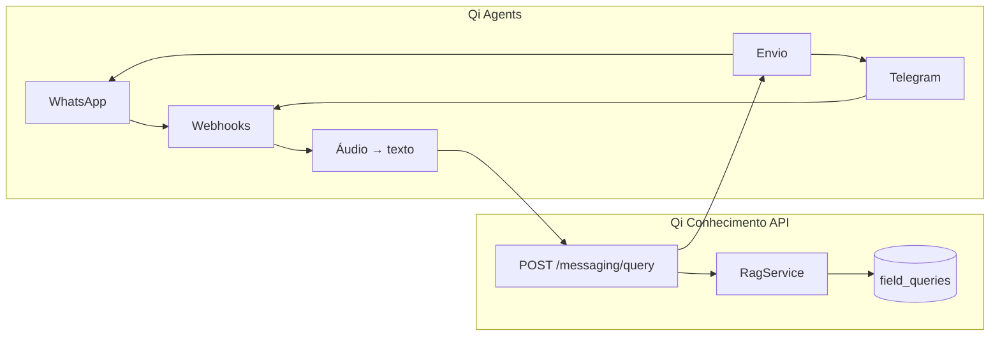

# Integração Qi Agents ↔ Qi Conhecimento

O **Qi Agents** é o projeto responsável por **canais de mensageria** (WhatsApp, Telegram): webhooks, transcrição de áudio, formatação e envio de respostas.

O **Qi Conhecimento** expõe o **cérebro RAG** via `POST /messaging/query` — busca híbrida, LLM e persistência em `field_queries`.

> Não duplique webhooks Meta/Telegram no qi-conhecimento. Configure um canal no qi-agents apontando para a API de conhecimento.

## Divisão de responsabilidades

| Responsabilidade | Qi Agents | Qi Conhecimento |
| --- | --- | --- |
| Webhook WhatsApp / Telegram | ✅ | ❌ (stubs legados, não usar) |
| Transcrição de áudio (Whisper etc.) | ✅ | ❌ |
| Envio de mensagem ao usuário | ✅ | ❌ |
| RAG (busca + LLM + citações) | ❌ | ✅ |
| Ingestão de normas/PDFs | ❌ | ✅ (`apps/admin`) |
| Histórico `field_queries` | ❌ (opcional espelhar) | ✅ |
| Admin `/queries` (futuro) | ❌ | ✅ |

## Arquitetura



## Configuração no Qi Agents

1. Crie um canal (WhatsApp ou Telegram) no qi-agents.
2. Aponte o **backend HTTP** para a API de conhecimento:

| Ambiente | URL |
| --- | --- |
| Local | `http://localhost:3100/messaging/query` |
| Produção | `https://<sua-api>/messaging/query` |

3. Mapeie a mensagem do usuário para o body JSON abaixo.
4. Use `answer` + `citations[]` da resposta para montar a mensagem enviada ao canal.

### Contrato de request

```json
{
  "queryText": "Qual o recuo mínimo do tubo de esgoto?",
  "channel": "whatsapp",
  "externalUserId": "5511999999999",
  "specialtyFilter": "hidraulica",
  "transcribedFromAudio": false
}
```

| Campo | Obrigatório | Descrição |
| --- | --- | --- |
| `queryText` | Sim | Pergunta (3–2000 caracteres) |
| `channel` | Sim | `whatsapp` ou `telegram` |
| `externalUserId` | Sim | ID do usuário no canal (telefone, chat id) |
| `specialtyFilter` | Não | `civil`, `hidraulica`, `eletrica`, `seguranca_trabalho` |
| `transcribedFromAudio` | Não | `true` se o qi-agents transcreveu áudio antes de chamar |

**Dica:** fixe `specialtyFilter` por canal no qi-agents (ex.: canal “Elétrica” → `eletrica`).

### Contrato de response

A API retorna um registro `FieldQuery` (JSON com `id`):

```json
{
  "id": "...",
  "queryText": "...",
  "channel": "whatsapp",
  "externalUserId": "5511999999999",
  "answer": "Conforme NBR 8160, item 4.2.1...",
  "citations": [
    {
      "documentId": "...",
      "documentTitle": "NBR 8160 — Instalações prediais de esgoto sanitário",
      "normReference": "NBR 8160",
      "normItem": "4.2.1",
      "pageStart": 12,
      "chunkId": "...",
      "excerpt": "...",
      "sourceUrl": "..."
    }
  ],
  "createdAt": "..."
}
```

### Formatação sugerida no Qi Agents

Monte a mensagem do canal a partir da resposta:

```
{answer}

📎 Fontes:
• {normReference}, item {normItem} (p. {pageStart})
• ...
```

Campos úteis para citação: `normReference`, `normItem`, `pageStart`, `tableCaption`, `documentTitle`.

## Pré-requisitos no Qi Conhecimento

Para respostas enriquecidas (não só template):

```env
LLM_PROVIDER=anthropic          # ou openai
ANTHROPIC_API_KEY=sk-ant-...
# ou OPENAI_API_KEY=sk-...

EMBEDDING_PROVIDER=ollama         # ou openai — busca híbrida
```

Sem LLM configurado, a API usa fallback template (`"Conforme NBR X: excerpt..."`).

## Teste local (sem qi-agents)

1. `pnpm dev` (API + admin)
2. Swagger → http://localhost:3100/api → `POST /messaging/query`
3. Ou curl:

```bash
curl -X POST http://localhost:3100/messaging/query \
  -H "Content-Type: application/json" \
  -d "{\"queryText\":\"Qual o recuo mínimo do tubo de esgoto?\",\"channel\":\"whatsapp\",\"externalUserId\":\"5511999999999\",\"specialtyFilter\":\"hidraulica\"}"
```

## Bancos de dados

Use **MongoDB separado** por projeto:

| Projeto | Banco sugerido |
| --- | --- |
| Qi Conhecimento | `qi-conhecimento` |
| Qi Agents | `qi-agents` |

Não restaure dumps de um projeto no banco do outro. Ver `pnpm cleanup:qi-agents` se collections do conhecimento aparecerem no banco errado.

## Segurança (recomendado para produção)

Hoje `POST /messaging/query` é `@PublicAccess()` — qualquer cliente pode chamar.

Antes de expor em produção:

- [ ] API key serviço-a-serviço (ex.: header `X-Service-Key`)
- [ ] Restringir origem no qi-agents (chamada server-side, não browser)
- [ ] Rate limit por `externalUserId` ou IP do qi-agents

## O que **não** implementar no Qi Conhecimento

Itens absorvidos pelo qi-agents — **fora do escopo** deste repositório:

- Webhook WhatsApp POST funcional
- Meta Graph API (envio)
- Bot Telegram
- Fila BullMQ `send-field-response`
- Whisper / transcrição de áudio

Webhooks em `/messaging/whatsapp/*` permanecem como **legado/stub**; novos canais devem usar qi-agents.

## Pendências no Qi Conhecimento (Fase 3)

| Item | Status |
| --- | --- |
| `POST /messaging/query` (RAG + citações) | ✅ Entregue |
| Integração documentada com qi-agents | ✅ Este guia |
| API key serviço-a-serviço | Planejado |
| Admin `/queries` — histórico de consultas | Planejado |

## Referências

- [messaging.md](../architecture/messaging.md) — módulo e endpoints
- [phase-3.md](../development/phase-3.md) — escopo revisado da fase
- [scope/product-vision.md](../scope/product-vision.md) — visão de produto
