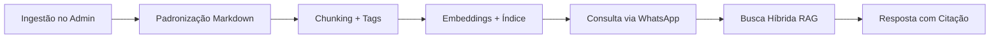

# Visão do Produto — Ecossistema de Conhecimento Técnico para Engenharia

## 1. Visão Geral

O **Qi Conhecimento** é uma plataforma web e um assistente inteligente focado no setor de **Engenharia Civil e de Instalações** (Hidráulica/Elétrica). O sistema funciona como um **Hub Multimodal de Conhecimento**, coletando dados técnicos de diversas fontes, tratando-os via arquitetura **RAG** (Retrieval-Augmented Generation) e entregando respostas precisas, rápidas e contextualizadas para engenheiros e técnicos no canteiro de obras — via aplicativos de mensagens.

## 2. Pilares Estruturais

### Pilar 1: Hub de Entrada Multimodal (Backoffice / `apps/admin`)

Responsável pela ingestão, categorização e preparação de dados:

- **Módulos de Especialidade:** Civil, Hidráulica, Elétrica, Segurança do Trabalho
- **Importador de Arquivos Técnicos:** PDFs nativos (NBRs, Cadernos de Encargos), manuais de fabricantes
- **Leitor de Imagens (Visão Computacional):** OCR de fotos de projetos, prints e esquemas
- **Editor de Texto Nativo (CMS):** Procedimentos internos, notas de campo, boas práticas
- **Importador de Links/HTML:** Artigos técnicos com extração de conteúdo útil

**Implementação atual:** telas admin + endpoints `POST /knowledge/documents` e `POST /knowledge/documents/manual-content`

### Pilar 2: Esteira de Padronização e Motor RAG (API — invisível ao usuário)

- Padronização universal → Markdown estruturado
- Chunking inteligente por tópico/subcapítulo
- Metadados: tipo, norma/fonte, capítulo, área, autor
- Indexação semântica (embeddings) + busca híbrida (texto + sentido)

**Implementação atual:** schemas `KnowledgeDocument` + `KnowledgeChunk`, fila `ingestion`, `POST /knowledge/search`

### Pilar 3: Interface de Campo (Assistente de Obra)

- Canal WhatsApp/Telegram
- Entrada texto e áudio (transcrição)
- Respostas curtas com citação obrigatória (ex: "Conforme NBR 5410, item 6.2.1...")
- Link/imagem da fonte original quando relevante

**Implementação atual:** `POST /messaging/query`, webhooks WhatsApp (stub), schema `FieldQuery`

## 3. Fluxo de Valor do Dado

1. Administrador insere norma PDF, foto de tabela e procedimento interno
2. Esteira extrai, fatia e gera metadados
3. Conteúdo e embeddings são persistidos no MongoDB
4. Engenheiro pergunta via áudio no WhatsApp
5. Motor recupera chunks, filtra por especialidade e responde com item da norma

## 4. Roadmap técnico (próximas entregas)

- [ ] Parser PDF + preservação de tabelas
- [ ] OCR / visão computacional para imagens
- [ ] Extractor HTML (Readability / similar)
- [ ] Embeddings OpenAI + índice vetorial
- [ ] Integração Meta WhatsApp Cloud API completa
- [ ] Transcrição de áudio (Whisper ou equivalente)
- [ ] Bot Telegram
