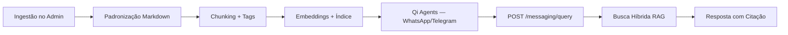

# Visão do Produto — Ecossistema de Conhecimento Técnico para Engenharia

## 1. Visão Geral

O **Qi Conhecimento** é uma plataforma web e um assistente inteligente focado no setor de **Engenharia Civil e de Instalações** (Hidráulica/Elétrica). O sistema funciona como um **Hub Multimodal de Conhecimento**, coletando dados técnicos de diversas fontes, tratando-os via arquitetura **RAG** (Retrieval-Augmented Generation) e entregando respostas precisas, rápidas e contextualizadas para engenheiros e técnicos no canteiro de obras — via aplicativos de mensagens.

## 2. Pilares Estruturais

### Pilar 1: Hub de Entrada Multimodal (Backoffice / `apps/admin`)

Responsável pela ingestão, categorização e preparação de dados:

- **Módulos de Especialidade:** Civil, Hidráulica, Elétrica, Segurança do Trabalho
- **Importador de Arquivos Técnicos:** PDFs nativos (NBRs, Cadernos de Encargos), manuais de fabricantes
- **Leitor de Imagens (Visão Computacional):** OCR de fotos de projetos, prints e esquemas
- **Editor de Texto Nativo (CMS):** Procedimentos internos, notas de campo, boas práticas
- **Importador de Links/HTML:** Artigos técnicos com extração de conteúdo útil

**Implementação atual (Fase 1 + 2):**

- Admin: `/import` (PDF, imagem, link), `/manual-content` (CMS), `/documents`, `/search`
- API: `POST /knowledge/documents/upload`, `POST /knowledge/documents/import-link`, `POST /knowledge/cms`, `POST /knowledge/web-imports`
- Parsers: PDF (`pdf-parse`), imagem (OpenAI Vision), HTML (Cheerio)
- Storage local em `STORAGE_PATH`

### Pilar 2: Esteira de Padronização e Motor RAG (API — invisível ao usuário)

- Padronização universal → Markdown estruturado
- Chunking inteligente por tópico/subcapítulo
- Metadados: tipo, norma/fonte, capítulo, área, autor
- Indexação semântica (embeddings) + busca híbrida (texto + vetorial)

**Implementação atual (Fase 2):**

- BullMQ: `process-document`, `generate-embeddings`
- `EmbeddingService` (OpenAI) + `RagService` (RRF + LLM)
- Busca: `POST /knowledge/search`
- Embeddings em `chunk.embedding[]` (cosine similarity in-app)

### Pilar 3: Interface de Campo (Assistente de Obra)

- Canal WhatsApp/Telegram
- Entrada texto e áudio (transcrição)
- Respostas curtas com citação obrigatória (ex: "Conforme NBR 5410, item 6.2.1...")
- Link/imagem da fonte original quando relevante

**Implementação atual:**

- `POST /messaging/query` — RAG completo (busca híbrida + LLM + `citations[]`)
- `POST /knowledge/public-ask` — mesma pipeline; canal `web` em `field_queries`
- Persistência em `field_queries` (`whatsapp`, `telegram`, `web`, `admin`)
- **Canais WhatsApp/Telegram** — projeto **[Qi Agents](../../integrations/qi-agents.md)** (webhooks, áudio, envio)
- Webhooks `/messaging/whatsapp/*` neste repo — legado/stub; **não usar** para novos canais
- Service key `X-Service-Key` em `/messaging/query` + admin `/queries` (histórico) — entregues

## 3. Fluxo de Valor do Dado

1. Administrador insere norma PDF, foto de tabela e procedimento interno
2. Esteira extrai, fatia e gera metadados
3. Conteúdo e embeddings são persistidos no MongoDB
4. Engenheiro pergunta via WhatsApp/Telegram (**Qi Agents** recebe; áudio → texto se necessário)
5. Qi Agents chama `POST /messaging/query`; motor recupera chunks e responde com item da norma
6. Qi Agents formata e envia a mensagem ao usuário

## 4. Roadmap técnico

### Fase 1 (concluída)

- [x] Admin conectado à API (RTK Query, JWT, CMS, listagem, busca texto)
- [x] Seed piloto NBR (3 procedimentos)

### Fase 2 (concluída)

- [x] Parser PDF + heurística de tabelas → Markdown
- [x] OCR / visão computacional para imagens (OpenAI Vision)
- [x] Extractor HTML (Cheerio)
- [x] Embeddings OpenAI + busca vetorial (cosine in-app)
- [x] RAG com LLM (`RagService`)
- [x] Upload admin PDF/imagem/link

### Fase 3 (em andamento)

Arquitetura com **[Qi Agents](../../integrations/qi-agents.md)** como camada de canais.

**Qi Agents (projeto externo):**

- [ ] Canal WhatsApp → `POST /messaging/query`
- [ ] Canal Telegram → mesmo endpoint
- [ ] Transcrição de áudio antes da chamada API
- [ ] Formatação e envio da resposta ao usuário

**Qi Conhecimento (este repositório):**

- [x] `POST /messaging/query` — RAG + citações + `field_queries`
- [x] Documentação de integração
- [x] API key serviço-a-serviço (`X-Service-Key`)
- [x] Histórico de consultas de campo no admin (`/queries`)
- [x] Auditoria unificada — `public-ask`, admin `/search` e `/messaging/query` → `field_queries`

Guias: [phase-1.md](../development/phase-1.md) · [phase-2.md](../development/phase-2.md) · [phase-3.md](../development/phase-3.md) · [qi-agents.md](../integrations/qi-agents.md)
